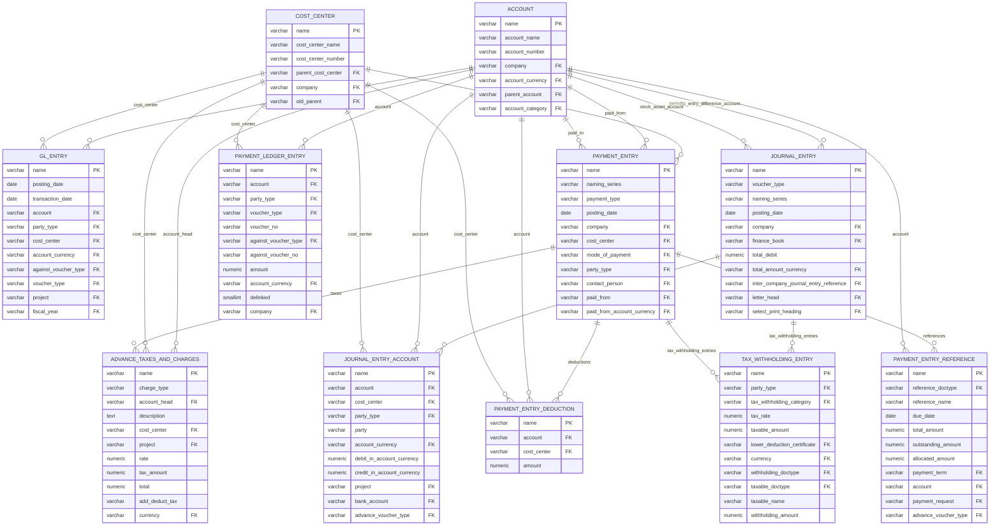

# Core entity graph (accounts + trade + inventory)

### Core masters

```mermaid
erDiagram
  ACCOUNT {
    varchar name PK
    varchar account_name
    varchar account_number
    varchar company FK
    varchar account_currency FK
    varchar parent_account FK
    varchar account_category FK
  }
  BATCH {
    varchar name PK
    varchar batch_id
    varchar item FK
    varchar parent_batch FK
    varchar supplier FK
    varchar reference_doctype FK
    varchar item_name
    numeric batch_qty
    varchar stock_uom FK
  }
  COMPANY {
    varchar name PK
    varchar company_name
    varchar abbr
    smallint is_group
    varchar default_finance_book FK
    varchar parent_company FK
    varchar default_currency FK
    varchar default_letter_head FK
    varchar default_holiday_list FK
    varchar default_warehouse_for_sales_return FK
    varchar country FK
  }
  COST_CENTER {
    varchar name PK
    varchar cost_center_name
    varchar cost_center_number
    varchar parent_cost_center FK
    varchar company FK
    varchar old_parent FK
  }
  CURRENCY_EXCHANGE {
    varchar name PK
    date date
    varchar from_currency FK
    varchar to_currency FK
    numeric exchange_rate
  }
  CUSTOMER {
    varchar name PK
    varchar customer_name
    varchar gender FK
    varchar customer_type
    varchar default_bank_account FK
    varchar lead_name FK
    varchar account_manager FK
    varchar customer_group FK
    varchar territory FK
    varchar tax_category FK
    varchar represents_company FK
  }
  FISCAL_YEAR {
    varchar name PK
    varchar year
    date year_start_date
    date year_end_date
  }
  ITEM {
    varchar name PK
    varchar item_code
    varchar variant_of FK
    varchar item_group FK
    varchar stock_uom FK
    smallint is_fixed_asset
    varchar asset_category FK
    varchar brand FK
    varchar weight_uom FK
    varchar purchase_uom FK
    varchar country_of_origin FK
  }
  ITEM_GROUP {
    varchar name PK
    varchar item_group_name
    varchar parent_item_group FK
    smallint is_group
    varchar old_parent FK
  }
  ITEM_PRICE {
    varchar name PK
    varchar item_code FK
    varchar uom FK
    varchar item_name
    varchar brand FK
    varchar price_list FK
    varchar customer FK
    varchar supplier FK
    varchar currency FK
    numeric price_list_rate
    varchar reference
  }
  PAYMENT_TERMS_TEMPLATE {
    varchar name PK
  }
  PRICE_LIST {
    varchar name PK
    varchar price_list_name
    varchar currency FK
    smallint buying
    smallint selling
  }
  PURCHASE_TAXES_AND_CHARGES_TEMPLATE {
    varchar name PK
    varchar title
    smallint is_default
    smallint disabled
    varchar company FK
    varchar tax_category FK
  }
  SALES_TAXES_AND_CHARGES_TEMPLATE {
    varchar name PK
    varchar title
    smallint is_default
    varchar company FK
    varchar tax_category FK
  }
  SERIAL_NO {
    varchar name PK
    varchar serial_no
    varchar item_code FK
    varchar item_group FK
    varchar brand FK
    varchar asset FK
    varchar location FK
    varchar employee FK
    varchar company FK
    varchar work_order FK
    varchar warehouse FK
  }
  SUPPLIER {
    varchar name PK
    varchar supplier_name
    varchar country FK
    varchar default_bank_account FK
    varchar tax_category FK
    varchar tax_withholding_category FK
    varchar represents_company FK
    varchar supplier_group FK
    varchar supplier_type
    varchar language FK
    varchar default_currency FK
  }
  TAX_CATEGORY {
    varchar name PK
    varchar title
  }
  UOM_CONVERSION_DETAIL {
    varchar name PK
    varchar uom FK
    numeric conversion_factor
  }
  WAREHOUSE {
    varchar name PK
    varchar warehouse_name
    smallint is_group
    varchar company FK
    varchar account FK
    varchar parent_warehouse FK
    varchar old_parent FK
    varchar warehouse_type FK
    varchar default_in_transit_warehouse FK
    varchar customer FK
  }
  COMPANY ||--o{ ACCOUNT : company
  ITEM ||--o{ BATCH : item
  SUPPLIER ||--o{ BATCH : supplier
  WAREHOUSE ||--o{ COMPANY : default_warehouse_for_sales_return
  ACCOUNT ||--o{ COMPANY : default_bank_account
  ACCOUNT ||--o{ COMPANY : default_cash_account
  ACCOUNT ||--o{ COMPANY : default_receivable_account
  ACCOUNT ||--o{ COMPANY : round_off_account
  COST_CENTER ||--o{ COMPANY : round_off_cost_center
  ACCOUNT ||--o{ COMPANY : write_off_account
  ACCOUNT ||--o{ COMPANY : exchange_gain_loss_account
  ACCOUNT ||--o{ COMPANY : unrealized_exchange_gain_loss_account
  ACCOUNT ||--o{ COMPANY : default_payable_account
  ACCOUNT ||--o{ COMPANY : default_expense_account
  ACCOUNT ||--o{ COMPANY : default_income_account
  ACCOUNT ||--o{ COMPANY : default_deferred_revenue_account
  ACCOUNT ||--o{ COMPANY : default_deferred_expense_account
  COST_CENTER ||--o{ COMPANY : cost_center
  PAYMENT_TERMS_TEMPLATE ||--o{ COMPANY : payment_terms
  ACCOUNT ||--o{ COMPANY : default_inventory_account
  ACCOUNT ||--o{ COMPANY : stock_adjustment_account
  ACCOUNT ||--o{ COMPANY : default_purchase_price_variance_account
  ACCOUNT ||--o{ COMPANY : default_manufacturing_variance_account
  ACCOUNT ||--o{ COMPANY : stock_received_but_not_billed
  ACCOUNT ||--o{ COMPANY : accumulated_depreciation_account
  ACCOUNT ||--o{ COMPANY : depreciation_expense_account
  ACCOUNT ||--o{ COMPANY : disposal_account
  COST_CENTER ||--o{ COMPANY : depreciation_cost_center
  ACCOUNT ||--o{ COMPANY : capital_work_in_progress_account
  ACCOUNT ||--o{ COMPANY : asset_received_but_not_billed
  WAREHOUSE ||--o{ COMPANY : default_in_transit_warehouse
  WAREHOUSE ||--o{ COMPANY : default_warehouse
  WAREHOUSE ||--o{ COMPANY : sample_retention_warehouse
  ACCOUNT ||--o{ COMPANY : unrealized_profit_loss_account
  ACCOUNT ||--o{ COMPANY : default_discount_account
  ACCOUNT ||--o{ COMPANY : default_provisional_account
  ACCOUNT ||--o{ COMPANY : default_advance_received_account
  ACCOUNT ||--o{ COMPANY : default_advance_paid_account
  ACCOUNT ||--o{ COMPANY : default_operating_cost_account
  ACCOUNT ||--o{ COMPANY : round_off_for_opening
  ACCOUNT ||--o{ COMPANY : purchase_expense_account
  ACCOUNT ||--o{ COMPANY : purchase_expense_contra_account
  ACCOUNT ||--o{ COMPANY : service_expense_account
  ACCOUNT ||--o{ COMPANY : expenses_added_to_stock_account
  ACCOUNT ||--o{ COMPANY : expenses_added_to_stock_contra_account
  WAREHOUSE ||--o{ COMPANY : default_wip_warehouse
  WAREHOUSE ||--o{ COMPANY : default_fg_warehouse
  WAREHOUSE ||--o{ COMPANY : default_scrap_warehouse
  ACCOUNT ||--o{ COMPANY : stock_delivered_but_not_billed
  COMPANY ||--o{ COST_CENTER : company
  TAX_CATEGORY ||--o{ CUSTOMER : tax_category
  COMPANY ||--o{ CUSTOMER : represents_company
  PRICE_LIST ||--o{ CUSTOMER : default_price_list
  PAYMENT_TERMS_TEMPLATE ||--o{ CUSTOMER : payment_terms
  ITEM ||--o{ UOM_CONVERSION_DETAIL : uoms
  ITEM_GROUP ||--o{ ITEM : item_group
  ITEM ||--o{ ITEM_PRICE : item_code
  PRICE_LIST ||--o{ ITEM_PRICE : price_list
  CUSTOMER ||--o{ ITEM_PRICE : customer
  SUPPLIER ||--o{ ITEM_PRICE : supplier
  BATCH ||--o{ ITEM_PRICE : batch_no
  COMPANY ||--o{ PURCHASE_TAXES_AND_CHARGES_TEMPLATE : company
  TAX_CATEGORY ||--o{ PURCHASE_TAXES_AND_CHARGES_TEMPLATE : tax_category
  COMPANY ||--o{ SALES_TAXES_AND_CHARGES_TEMPLATE : company
  TAX_CATEGORY ||--o{ SALES_TAXES_AND_CHARGES_TEMPLATE : tax_category
  ITEM ||--o{ SERIAL_NO : item_code
  ITEM_GROUP ||--o{ SERIAL_NO : item_group
  COMPANY ||--o{ SERIAL_NO : company
  WAREHOUSE ||--o{ SERIAL_NO : warehouse
  BATCH ||--o{ SERIAL_NO : batch_no
  CUSTOMER ||--o{ SERIAL_NO : customer
  TAX_CATEGORY ||--o{ SUPPLIER : tax_category
  COMPANY ||--o{ SUPPLIER : represents_company
  PRICE_LIST ||--o{ SUPPLIER : default_price_list
  PAYMENT_TERMS_TEMPLATE ||--o{ SUPPLIER : payment_terms
  COMPANY ||--o{ WAREHOUSE : company
  ACCOUNT ||--o{ WAREHOUSE : account
  CUSTOMER ||--o{ WAREHOUSE : customer
```

### Order to cash

```mermaid
erDiagram
  ALLOWED_TO_TRANSACT_WITH {
    varchar name PK
    varchar company FK
  }
  COMPANY_RESTRICTION {
    varchar name PK
    varchar company FK
  }
  CUSTOMER {
    varchar name PK
    varchar customer_name
    varchar gender FK
    varchar customer_type
    varchar default_bank_account FK
    varchar lead_name FK
    varchar account_manager FK
    varchar customer_group FK
    varchar territory FK
    varchar tax_category FK
    varchar represents_company FK
  }
  CUSTOMER_CREDIT_LIMIT {
    varchar name PK
    numeric credit_limit
    numeric overdue_billing_threshold
    varchar company FK
    smallint bypass_credit_limit_check
  }
  DELIVERY_NOTE {
    varchar name PK
    varchar naming_series
    varchar customer FK
    varchar amended_from FK
    varchar company FK
    date posting_date
    time posting_time
    varchar return_against FK
    varchar shipping_address_name FK
    varchar contact_person FK
    varchar customer_address FK
  }
  DELIVERY_NOTE_ITEM {
    varchar name PK
    varchar item_code FK
    varchar product_bundle FK
    varchar item_name
    numeric qty
    varchar stock_uom FK
    varchar uom FK
    numeric conversion_factor
    numeric rate
    numeric amount
    varchar weight_uom FK
  }
  ITEM {
    varchar name PK
    varchar item_code
    varchar variant_of FK
    varchar item_group FK
    varchar stock_uom FK
    smallint is_fixed_asset
    varchar asset_category FK
    varchar brand FK
    varchar weight_uom FK
    varchar purchase_uom FK
    varchar country_of_origin FK
  }
  ITEM_BARCODE {
    varchar name PK
    varchar barcode
    varchar barcode_type
    varchar uom FK
  }
  ITEM_CUSTOMER_DETAIL {
    varchar name PK
    varchar customer_name FK
    varchar customer_group FK
    varchar ref_code
  }
  ITEM_DEFAULT {
    varchar name PK
    varchar company FK
    varchar default_warehouse FK
    varchar default_price_list FK
    varchar default_discount_account FK
    varchar default_inventory_account FK
    varchar inventory_account_currency FK
    varchar buying_cost_center FK
    varchar default_supplier FK
    varchar expense_account FK
    varchar default_provisional_account FK
  }
  ITEM_REORDER {
    varchar name PK
    varchar warehouse_group FK
    varchar warehouse FK
    numeric warehouse_reorder_level
    numeric warehouse_reorder_qty
    varchar material_request_type
  }
  ITEM_SUPPLIER {
    varchar name PK
    varchar supplier FK
    varchar supplier_part_no
  }
  ITEM_TAX {
    varchar name PK
    varchar item_tax_template FK
    varchar tax_category FK
    date valid_from
    numeric maximum_net_rate
    numeric minimum_net_rate
  }
  ITEM_VARIANT_ATTRIBUTE {
    varchar name PK
    varchar variant_of FK
    varchar attribute FK
    varchar attribute_value
  }
  ITEM_WISE_TAX_DETAIL {
    varchar name PK
    varchar item_row
    varchar tax_row
    numeric rate
    numeric amount
    numeric taxable_amount
  }
  PACKED_ITEM {
    varchar name PK
    varchar parent_item FK
    varchar item_code FK
    varchar product_bundle FK
    text description
    varchar warehouse FK
    varchar target_warehouse FK
    numeric qty
    varchar batch_no FK
    varchar uom FK
    numeric rate
  }
  PARTY_ACCOUNT {
    varchar name PK
    varchar company FK
    varchar account FK
    varchar advance_account FK
  }
  PAYMENT_SCHEDULE {
    varchar name PK
    varchar payment_term FK
    text description
    date due_date
    numeric invoice_portion
    numeric payment_amount
    varchar mode_of_payment FK
  }
  PORTAL_USER {
    varchar name PK
    varchar user FK
  }
  PRICING_RULE_DETAIL {
    varchar name PK
    varchar pricing_rule FK
    varchar item_code
  }
  SALES_INVOICE {
    varchar name PK
    varchar naming_series
    varchar customer FK
    varchar project FK
    varchar pos_profile FK
    varchar company FK
    varchar cost_center FK
    date posting_date
    date due_date
    varchar amended_from FK
    varchar return_against FK
  }
  SALES_INVOICE_ADVANCE {
    varchar name PK
    varchar reference_type FK
    varchar reference_name
    text remarks
    numeric advance_amount
    numeric allocated_amount
    date difference_posting_date
  }
  SALES_INVOICE_ITEM {
    varchar name PK
    varchar item_code FK
    varchar product_bundle FK
    varchar item_name
    numeric qty
    varchar stock_uom FK
    varchar uom FK
    numeric conversion_factor
    numeric rate
    numeric amount
    numeric base_rate
  }
  SALES_INVOICE_PAYMENT {
    varchar name PK
    varchar mode_of_payment FK
    numeric amount
    varchar account FK
  }
  SALES_INVOICE_TIMESHEET {
    varchar name PK
    varchar time_sheet FK
    numeric billing_hours
    numeric billing_amount
    varchar activity_type FK
    text description
  }
  SALES_ORDER {
    varchar name PK
    varchar naming_series
    varchar customer FK
    varchar order_type
    varchar amended_from FK
    varchar company FK
    date transaction_date
    date delivery_date
    varchar customer_address FK
    varchar contact_person FK
    varchar company_address FK
  }
  SALES_ORDER_ITEM {
    varchar name PK
    varchar item_code FK
    varchar product_bundle FK
    varchar item_name
    date delivery_date
    numeric qty
    varchar stock_uom FK
    varchar uom FK
    numeric conversion_factor
    numeric rate
    numeric amount
  }
  SALES_TAXES_AND_CHARGES {
    varchar name PK
    varchar charge_type
    varchar account_head FK
    varchar cost_center FK
    text description
    numeric rate
    numeric tax_amount
    numeric total
    varchar project FK
    varchar account_currency FK
    numeric net_amount
  }
  SALES_TEAM {
    varchar name PK
    varchar sales_person FK
    varchar contact_no
    numeric allocated_percentage
    numeric allocated_amount
    numeric commission_rate
    numeric incentives
  }
  SUPPLIER_NUMBER_AT_CUSTOMER {
    varchar name PK
    varchar company FK
    varchar supplier_number
  }
  TAX_WITHHOLDING_ENTRY {
    varchar name PK
    varchar party_type FK
    varchar tax_withholding_category FK
    numeric tax_rate
    numeric taxable_amount
    varchar lower_deduction_certificate FK
    varchar currency FK
    varchar withholding_doctype FK
    varchar taxable_doctype FK
    varchar taxable_name
    numeric withholding_amount
  }
  UOM_CONVERSION_DETAIL {
    varchar name PK
    varchar uom FK
    numeric conversion_factor
  }
  WAREHOUSE {
    varchar name PK
    varchar warehouse_name
    smallint is_group
    varchar company FK
    varchar account FK
    varchar parent_warehouse FK
    varchar old_parent FK
    varchar warehouse_type FK
    varchar default_in_transit_warehouse FK
    varchar customer FK
  }
  CUSTOMER ||--o{ ALLOWED_TO_TRANSACT_WITH : companies
  CUSTOMER ||--o{ PARTY_ACCOUNT : accounts
  CUSTOMER ||--o{ SALES_TEAM : sales_team
  CUSTOMER ||--o{ CUSTOMER_CREDIT_LIMIT : credit_limits
  CUSTOMER ||--o{ COMPANY_RESTRICTION : allowed_companies
  CUSTOMER ||--o{ PORTAL_USER : portal_users
  CUSTOMER ||--o{ SUPPLIER_NUMBER_AT_CUSTOMER : supplier_numbers
  DELIVERY_NOTE ||--o{ DELIVERY_NOTE_ITEM : items
  DELIVERY_NOTE ||--o{ PRICING_RULE_DETAIL : pricing_rules
  DELIVERY_NOTE ||--o{ PACKED_ITEM : packed_items
  DELIVERY_NOTE ||--o{ SALES_TAXES_AND_CHARGES : taxes
  DELIVERY_NOTE ||--o{ SALES_TEAM : sales_team
  DELIVERY_NOTE ||--o{ ITEM_WISE_TAX_DETAIL : item_wise_tax_details
  CUSTOMER ||--o{ DELIVERY_NOTE : customer
  WAREHOUSE ||--o{ DELIVERY_NOTE : set_warehouse
  WAREHOUSE ||--o{ DELIVERY_NOTE : set_target_warehouse
  ITEM ||--o{ DELIVERY_NOTE_ITEM : item_code
  WAREHOUSE ||--o{ DELIVERY_NOTE_ITEM : warehouse
  WAREHOUSE ||--o{ DELIVERY_NOTE_ITEM : target_warehouse
  SALES_ORDER ||--o{ DELIVERY_NOTE_ITEM : against_sales_order
  SALES_INVOICE ||--o{ DELIVERY_NOTE_ITEM : against_sales_invoice
  ITEM ||--o{ ITEM_BARCODE : barcodes
  ITEM ||--o{ ITEM_REORDER : reorder_levels
  ITEM ||--o{ UOM_CONVERSION_DETAIL : uoms
  ITEM ||--o{ ITEM_VARIANT_ATTRIBUTE : attributes
  ITEM ||--o{ ITEM_DEFAULT : item_defaults
  ITEM ||--o{ ITEM_SUPPLIER : supplier_items
  ITEM ||--o{ ITEM_CUSTOMER_DETAIL : customer_items
  ITEM ||--o{ ITEM_TAX : taxes
  ITEM ||--o{ COMPANY_RESTRICTION : allowed_companies
  CUSTOMER ||--o{ ITEM_CUSTOMER_DETAIL : customer_name
  WAREHOUSE ||--o{ ITEM_DEFAULT : default_warehouse
  WAREHOUSE ||--o{ ITEM_REORDER : warehouse_group
  WAREHOUSE ||--o{ ITEM_REORDER : warehouse
  ITEM ||--o{ ITEM_VARIANT_ATTRIBUTE : variant_of
  ITEM ||--o{ PACKED_ITEM : parent_item
  ITEM ||--o{ PACKED_ITEM : item_code
  WAREHOUSE ||--o{ PACKED_ITEM : warehouse
  WAREHOUSE ||--o{ PACKED_ITEM : target_warehouse
  SALES_INVOICE ||--o{ SALES_INVOICE_ITEM : items
  SALES_INVOICE ||--o{ PRICING_RULE_DETAIL : pricing_rules
  SALES_INVOICE ||--o{ PACKED_ITEM : packed_items
  SALES_INVOICE ||--o{ SALES_INVOICE_TIMESHEET : timesheets
  SALES_INVOICE ||--o{ SALES_TAXES_AND_CHARGES : taxes
  SALES_INVOICE ||--o{ SALES_INVOICE_ADVANCE : advances
  SALES_INVOICE ||--o{ PAYMENT_SCHEDULE : payment_schedule
  SALES_INVOICE ||--o{ SALES_INVOICE_PAYMENT : payments
  SALES_INVOICE ||--o{ SALES_TEAM : sales_team
  SALES_INVOICE ||--o{ ITEM_WISE_TAX_DETAIL : item_wise_tax_details
  SALES_INVOICE ||--o{ TAX_WITHHOLDING_ENTRY : tax_withholding_entries
  CUSTOMER ||--o{ SALES_INVOICE : customer
  WAREHOUSE ||--o{ SALES_INVOICE : set_warehouse
  WAREHOUSE ||--o{ SALES_INVOICE : set_target_warehouse
  ITEM ||--o{ SALES_INVOICE_ITEM : item_code
  WAREHOUSE ||--o{ SALES_INVOICE_ITEM : warehouse
  WAREHOUSE ||--o{ SALES_INVOICE_ITEM : target_warehouse
  SALES_ORDER ||--o{ SALES_INVOICE_ITEM : sales_order
  DELIVERY_NOTE ||--o{ SALES_INVOICE_ITEM : delivery_note
  SALES_ORDER ||--o{ SALES_ORDER_ITEM : items
  SALES_ORDER ||--o{ PRICING_RULE_DETAIL : pricing_rules
  SALES_ORDER ||--o{ SALES_TAXES_AND_CHARGES : taxes
  SALES_ORDER ||--o{ PACKED_ITEM : packed_items
  SALES_ORDER ||--o{ PAYMENT_SCHEDULE : payment_schedule
  SALES_ORDER ||--o{ SALES_TEAM : sales_team
  SALES_ORDER ||--o{ ITEM_WISE_TAX_DETAIL : item_wise_tax_details
  CUSTOMER ||--o{ SALES_ORDER : customer
  WAREHOUSE ||--o{ SALES_ORDER : set_warehouse
  ITEM ||--o{ SALES_ORDER_ITEM : item_code
  WAREHOUSE ||--o{ SALES_ORDER_ITEM : warehouse
  WAREHOUSE ||--o{ SALES_ORDER_ITEM : target_warehouse
  ITEM ||--o{ SALES_ORDER_ITEM : fg_item
  CUSTOMER ||--o{ WAREHOUSE : customer
```

### Procure to pay

```mermaid
erDiagram
  ALLOWED_TO_TRANSACT_WITH {
    varchar name PK
    varchar company FK
  }
  COMPANY_RESTRICTION {
    varchar name PK
    varchar company FK
  }
  CUSTOMER_NUMBER_AT_SUPPLIER {
    varchar name PK
    varchar company FK
    varchar customer_number
  }
  ITEM {
    varchar name PK
    varchar item_code
    varchar variant_of FK
    varchar item_group FK
    varchar stock_uom FK
    smallint is_fixed_asset
    varchar asset_category FK
    varchar brand FK
    varchar weight_uom FK
    varchar purchase_uom FK
    varchar country_of_origin FK
  }
  ITEM_BARCODE {
    varchar name PK
    varchar barcode
    varchar barcode_type
    varchar uom FK
  }
  ITEM_CUSTOMER_DETAIL {
    varchar name PK
    varchar customer_name FK
    varchar customer_group FK
    varchar ref_code
  }
  ITEM_DEFAULT {
    varchar name PK
    varchar company FK
    varchar default_warehouse FK
    varchar default_price_list FK
    varchar default_discount_account FK
    varchar default_inventory_account FK
    varchar inventory_account_currency FK
    varchar buying_cost_center FK
    varchar default_supplier FK
    varchar expense_account FK
    varchar default_provisional_account FK
  }
  ITEM_REORDER {
    varchar name PK
    varchar warehouse_group FK
    varchar warehouse FK
    numeric warehouse_reorder_level
    numeric warehouse_reorder_qty
    varchar material_request_type
  }
  ITEM_SUPPLIER {
    varchar name PK
    varchar supplier FK
    varchar supplier_part_no
  }
  ITEM_TAX {
    varchar name PK
    varchar item_tax_template FK
    varchar tax_category FK
    date valid_from
    numeric maximum_net_rate
    numeric minimum_net_rate
  }
  ITEM_VARIANT_ATTRIBUTE {
    varchar name PK
    varchar variant_of FK
    varchar attribute FK
    varchar attribute_value
  }
  ITEM_WISE_TAX_DETAIL {
    varchar name PK
    varchar item_row
    varchar tax_row
    numeric rate
    numeric amount
    numeric taxable_amount
  }
  PARTY_ACCOUNT {
    varchar name PK
    varchar company FK
    varchar account FK
    varchar advance_account FK
  }
  PAYMENT_SCHEDULE {
    varchar name PK
    varchar payment_term FK
    text description
    date due_date
    numeric invoice_portion
    numeric payment_amount
    varchar mode_of_payment FK
  }
  PORTAL_USER {
    varchar name PK
    varchar user FK
  }
  PRICING_RULE_DETAIL {
    varchar name PK
    varchar pricing_rule FK
    varchar item_code
  }
  PURCHASE_INVOICE {
    varchar name PK
    varchar naming_series
    varchar supplier FK
    date due_date
    varchar company FK
    varchar cost_center FK
    date posting_date
    varchar amended_from FK
    varchar bill_no
    varchar return_against FK
    varchar supplier_address FK
  }
  PURCHASE_INVOICE_ADVANCE {
    varchar name PK
    varchar reference_type FK
    varchar reference_name
    text remarks
    numeric advance_amount
    numeric allocated_amount
    date difference_posting_date
  }
  PURCHASE_INVOICE_ITEM {
    varchar name PK
    varchar item_code FK
    varchar item_name
    numeric qty
    varchar stock_uom FK
    varchar uom FK
    numeric conversion_factor
    numeric stock_qty
    numeric rate
    numeric amount
    numeric base_rate
  }
  PURCHASE_ORDER {
    varchar name PK
    varchar naming_series
    varchar supplier FK
    varchar company FK
    date transaction_date
    date schedule_date
    varchar amended_from FK
    varchar customer FK
    varchar customer_contact_person FK
    varchar supplier_address FK
    varchar contact_person FK
  }
  PURCHASE_ORDER_ITEM {
    varchar name PK
    varchar item_code FK
    varchar item_name
    date schedule_date
    numeric qty
    varchar stock_uom FK
    varchar uom FK
    numeric conversion_factor
    numeric rate
    numeric amount
    numeric base_rate
  }
  PURCHASE_RECEIPT {
    varchar name PK
    varchar naming_series
    varchar supplier FK
    date posting_date
    time posting_time
    varchar company FK
    varchar return_against FK
    varchar supplier_address FK
    varchar contact_person FK
    varchar shipping_address FK
    varchar currency FK
  }
  PURCHASE_RECEIPT_ITEM {
    varchar name PK
    varchar item_code FK
    varchar item_name
    numeric received_qty
    numeric qty
    numeric rejected_qty
    varchar uom FK
    varchar stock_uom FK
    numeric conversion_factor
    numeric rate
    numeric amount
  }
  PURCHASE_RECEIPT_ITEM_SUPPLIED {
    varchar name PK
    varchar main_item_code FK
    varchar rm_item_code FK
    varchar batch_no FK
    numeric required_qty
    numeric consumed_qty
    varchar stock_uom FK
    numeric current_stock
    varchar reference_name
    varchar bom_detail_no
    varchar purchase_order FK
  }
  PURCHASE_TAXES_AND_CHARGES {
    varchar name PK
    varchar category
    varchar add_deduct_tax
    varchar charge_type
    varchar account_head FK
    varchar cost_center FK
    text description
    numeric rate
    numeric tax_amount
    numeric total
    varchar project FK
  }
  SUPPLIER {
    varchar name PK
    varchar supplier_name
    varchar country FK
    varchar default_bank_account FK
    varchar tax_category FK
    varchar tax_withholding_category FK
    varchar represents_company FK
    varchar supplier_group FK
    varchar supplier_type
    varchar language FK
    varchar default_currency FK
  }
  TAX_WITHHOLDING_ENTRY {
    varchar name PK
    varchar party_type FK
    varchar tax_withholding_category FK
    numeric tax_rate
    numeric taxable_amount
    varchar lower_deduction_certificate FK
    varchar currency FK
    varchar withholding_doctype FK
    varchar taxable_doctype FK
    varchar taxable_name
    numeric withholding_amount
  }
  UOM_CONVERSION_DETAIL {
    varchar name PK
    varchar uom FK
    numeric conversion_factor
  }
  WAREHOUSE {
    varchar name PK
    varchar warehouse_name
    smallint is_group
    varchar company FK
    varchar account FK
    varchar parent_warehouse FK
    varchar old_parent FK
    varchar warehouse_type FK
    varchar default_in_transit_warehouse FK
    varchar customer FK
  }
  ITEM ||--o{ ITEM_BARCODE : barcodes
  ITEM ||--o{ ITEM_REORDER : reorder_levels
  ITEM ||--o{ UOM_CONVERSION_DETAIL : uoms
  ITEM ||--o{ ITEM_VARIANT_ATTRIBUTE : attributes
  ITEM ||--o{ ITEM_DEFAULT : item_defaults
  ITEM ||--o{ ITEM_SUPPLIER : supplier_items
  ITEM ||--o{ ITEM_CUSTOMER_DETAIL : customer_items
  ITEM ||--o{ ITEM_TAX : taxes
  ITEM ||--o{ COMPANY_RESTRICTION : allowed_companies
  WAREHOUSE ||--o{ ITEM_DEFAULT : default_warehouse
  SUPPLIER ||--o{ ITEM_DEFAULT : default_supplier
  WAREHOUSE ||--o{ ITEM_REORDER : warehouse_group
  WAREHOUSE ||--o{ ITEM_REORDER : warehouse
  SUPPLIER ||--o{ ITEM_SUPPLIER : supplier
  ITEM ||--o{ ITEM_VARIANT_ATTRIBUTE : variant_of
  PURCHASE_INVOICE ||--o{ PURCHASE_INVOICE_ITEM : items
  PURCHASE_INVOICE ||--o{ PRICING_RULE_DETAIL : pricing_rules
  PURCHASE_INVOICE ||--o{ PURCHASE_RECEIPT_ITEM_SUPPLIED : supplied_items
  PURCHASE_INVOICE ||--o{ PURCHASE_TAXES_AND_CHARGES : taxes
  PURCHASE_INVOICE ||--o{ PURCHASE_INVOICE_ADVANCE : advances
  PURCHASE_INVOICE ||--o{ PAYMENT_SCHEDULE : payment_schedule
  PURCHASE_INVOICE ||--o{ ITEM_WISE_TAX_DETAIL : item_wise_tax_details
  PURCHASE_INVOICE ||--o{ TAX_WITHHOLDING_ENTRY : tax_withholding_entries
  SUPPLIER ||--o{ PURCHASE_INVOICE : supplier
  WAREHOUSE ||--o{ PURCHASE_INVOICE : set_warehouse
  WAREHOUSE ||--o{ PURCHASE_INVOICE : rejected_warehouse
  WAREHOUSE ||--o{ PURCHASE_INVOICE : set_from_warehouse
  WAREHOUSE ||--o{ PURCHASE_INVOICE : supplier_warehouse
  ITEM ||--o{ PURCHASE_INVOICE_ITEM : item_code
  WAREHOUSE ||--o{ PURCHASE_INVOICE_ITEM : warehouse
  WAREHOUSE ||--o{ PURCHASE_INVOICE_ITEM : rejected_warehouse
  PURCHASE_ORDER ||--o{ PURCHASE_INVOICE_ITEM : purchase_order
  PURCHASE_RECEIPT ||--o{ PURCHASE_INVOICE_ITEM : purchase_receipt
  WAREHOUSE ||--o{ PURCHASE_INVOICE_ITEM : from_warehouse
  PURCHASE_ORDER ||--o{ PURCHASE_ORDER_ITEM : items
  PURCHASE_ORDER ||--o{ PRICING_RULE_DETAIL : pricing_rules
  PURCHASE_ORDER ||--o{ PURCHASE_TAXES_AND_CHARGES : taxes
  PURCHASE_ORDER ||--o{ PAYMENT_SCHEDULE : payment_schedule
  PURCHASE_ORDER ||--o{ ITEM_WISE_TAX_DETAIL : item_wise_tax_details
  SUPPLIER ||--o{ PURCHASE_ORDER : supplier
  WAREHOUSE ||--o{ PURCHASE_ORDER : set_warehouse
  WAREHOUSE ||--o{ PURCHASE_ORDER : supplier_warehouse
  WAREHOUSE ||--o{ PURCHASE_ORDER : set_reserve_warehouse
  WAREHOUSE ||--o{ PURCHASE_ORDER : set_from_warehouse
  ITEM ||--o{ PURCHASE_ORDER_ITEM : item_code
  WAREHOUSE ||--o{ PURCHASE_ORDER_ITEM : warehouse
  ITEM ||--o{ PURCHASE_ORDER_ITEM : fg_item
  WAREHOUSE ||--o{ PURCHASE_ORDER_ITEM : from_warehouse
  PURCHASE_RECEIPT ||--o{ PURCHASE_RECEIPT_ITEM : items
  PURCHASE_RECEIPT ||--o{ PRICING_RULE_DETAIL : pricing_rules
  PURCHASE_RECEIPT ||--o{ PURCHASE_RECEIPT_ITEM_SUPPLIED : supplied_items
  PURCHASE_RECEIPT ||--o{ PURCHASE_TAXES_AND_CHARGES : taxes
  PURCHASE_RECEIPT ||--o{ ITEM_WISE_TAX_DETAIL : item_wise_tax_details
  SUPPLIER ||--o{ PURCHASE_RECEIPT : supplier
  WAREHOUSE ||--o{ PURCHASE_RECEIPT : set_warehouse
  WAREHOUSE ||--o{ PURCHASE_RECEIPT : rejected_warehouse
  WAREHOUSE ||--o{ PURCHASE_RECEIPT : supplier_warehouse
  WAREHOUSE ||--o{ PURCHASE_RECEIPT : set_from_warehouse
  ITEM ||--o{ PURCHASE_RECEIPT_ITEM : item_code
  WAREHOUSE ||--o{ PURCHASE_RECEIPT_ITEM : warehouse
  WAREHOUSE ||--o{ PURCHASE_RECEIPT_ITEM : rejected_warehouse
  PURCHASE_ORDER ||--o{ PURCHASE_RECEIPT_ITEM : purchase_order
  WAREHOUSE ||--o{ PURCHASE_RECEIPT_ITEM : from_warehouse
  PURCHASE_INVOICE ||--o{ PURCHASE_RECEIPT_ITEM : purchase_invoice
  ITEM ||--o{ PURCHASE_RECEIPT_ITEM_SUPPLIED : main_item_code
  ITEM ||--o{ PURCHASE_RECEIPT_ITEM_SUPPLIED : rm_item_code
  PURCHASE_ORDER ||--o{ PURCHASE_RECEIPT_ITEM_SUPPLIED : purchase_order
  SUPPLIER ||--o{ ALLOWED_TO_TRANSACT_WITH : companies
  SUPPLIER ||--o{ PARTY_ACCOUNT : accounts
  SUPPLIER ||--o{ COMPANY_RESTRICTION : allowed_companies
  SUPPLIER ||--o{ PORTAL_USER : portal_users
  SUPPLIER ||--o{ CUSTOMER_NUMBER_AT_SUPPLIER : customer_numbers
```

### Inventory movement + balances

```mermaid
erDiagram
  BATCH {
    varchar name PK
    varchar batch_id
    varchar item FK
    varchar parent_batch FK
    varchar supplier FK
    varchar reference_doctype FK
    varchar item_name
    numeric batch_qty
    varchar stock_uom FK
  }
  BIN {
    varchar name PK
    varchar warehouse FK
    varchar item_code FK
    numeric reserved_qty
    numeric actual_qty
    numeric ordered_qty
    varchar stock_uom FK
    varchar company FK
  }
  COMPANY_RESTRICTION {
    varchar name PK
    varchar company FK
  }
  ITEM {
    varchar name PK
    varchar item_code
    varchar variant_of FK
    varchar item_group FK
    varchar stock_uom FK
    smallint is_fixed_asset
    varchar asset_category FK
    varchar brand FK
    varchar weight_uom FK
    varchar purchase_uom FK
    varchar country_of_origin FK
  }
  ITEM_BARCODE {
    varchar name PK
    varchar barcode
    varchar barcode_type
    varchar uom FK
  }
  ITEM_CUSTOMER_DETAIL {
    varchar name PK
    varchar customer_name FK
    varchar customer_group FK
    varchar ref_code
  }
  ITEM_DEFAULT {
    varchar name PK
    varchar company FK
    varchar default_warehouse FK
    varchar default_price_list FK
    varchar default_discount_account FK
    varchar default_inventory_account FK
    varchar inventory_account_currency FK
    varchar buying_cost_center FK
    varchar default_supplier FK
    varchar expense_account FK
    varchar default_provisional_account FK
  }
  ITEM_REORDER {
    varchar name PK
    varchar warehouse_group FK
    varchar warehouse FK
    numeric warehouse_reorder_level
    numeric warehouse_reorder_qty
    varchar material_request_type
  }
  ITEM_SUPPLIER {
    varchar name PK
    varchar supplier FK
    varchar supplier_part_no
  }
  ITEM_TAX {
    varchar name PK
    varchar item_tax_template FK
    varchar tax_category FK
    date valid_from
    numeric maximum_net_rate
    numeric minimum_net_rate
  }
  ITEM_VARIANT_ATTRIBUTE {
    varchar name PK
    varchar variant_of FK
    varchar attribute FK
    varchar attribute_value
  }
  LANDED_COST_TAXES_AND_CHARGES {
    varchar name PK
    text description
    numeric amount
    varchar expense_account FK
    varchar account_currency FK
  }
  SERIAL_NO {
    varchar name PK
    varchar serial_no
    varchar item_code FK
    varchar item_group FK
    varchar brand FK
    varchar asset FK
    varchar location FK
    varchar employee FK
    varchar company FK
    varchar work_order FK
    varchar warehouse FK
  }
  STOCK_ENTRY {
    varchar name PK
    varchar naming_series
    varchar stock_entry_type FK
    varchar outgoing_stock_entry FK
    varchar source_stock_entry FK
    varchar purpose
    varchar company FK
    varchar work_order FK
    varchar purchase_order FK
    varchar subcontracting_order FK
    varchar delivery_note_no FK
  }
  STOCK_ENTRY_DETAIL {
    varchar name PK
    varchar s_warehouse FK
    varchar t_warehouse FK
    varchar item_code FK
    numeric qty
    numeric basic_rate
    varchar uom FK
    numeric conversion_factor
    varchar stock_uom FK
    varchar batch_no FK
    varchar quality_inspection FK
  }
  STOCK_LEDGER_ENTRY {
    varchar name PK
    varchar item_code FK
    varchar warehouse FK
    date posting_date
    varchar voucher_type FK
    varchar voucher_no
    numeric actual_qty
    numeric incoming_rate
    varchar stock_uom FK
    varchar project FK
    varchar company FK
  }
  UOM_CONVERSION_DETAIL {
    varchar name PK
    varchar uom FK
    numeric conversion_factor
  }
  WAREHOUSE {
    varchar name PK
    varchar warehouse_name
    smallint is_group
    varchar company FK
    varchar account FK
    varchar parent_warehouse FK
    varchar old_parent FK
    varchar warehouse_type FK
    varchar default_in_transit_warehouse FK
    varchar customer FK
  }
  ITEM ||--o{ BATCH : item
  WAREHOUSE ||--o{ BIN : warehouse
  ITEM ||--o{ BIN : item_code
  ITEM ||--o{ ITEM_BARCODE : barcodes
  ITEM ||--o{ ITEM_REORDER : reorder_levels
  ITEM ||--o{ UOM_CONVERSION_DETAIL : uoms
  ITEM ||--o{ ITEM_VARIANT_ATTRIBUTE : attributes
  ITEM ||--o{ ITEM_DEFAULT : item_defaults
  ITEM ||--o{ ITEM_SUPPLIER : supplier_items
  ITEM ||--o{ ITEM_CUSTOMER_DETAIL : customer_items
  ITEM ||--o{ ITEM_TAX : taxes
  ITEM ||--o{ COMPANY_RESTRICTION : allowed_companies
  WAREHOUSE ||--o{ ITEM_DEFAULT : default_warehouse
  WAREHOUSE ||--o{ ITEM_REORDER : warehouse_group
  WAREHOUSE ||--o{ ITEM_REORDER : warehouse
  ITEM ||--o{ ITEM_VARIANT_ATTRIBUTE : variant_of
  ITEM ||--o{ SERIAL_NO : item_code
  WAREHOUSE ||--o{ SERIAL_NO : warehouse
  BATCH ||--o{ SERIAL_NO : batch_no
  STOCK_ENTRY ||--o{ STOCK_ENTRY_DETAIL : items
  STOCK_ENTRY ||--o{ LANDED_COST_TAXES_AND_CHARGES : additional_costs
  WAREHOUSE ||--o{ STOCK_ENTRY : from_warehouse
  WAREHOUSE ||--o{ STOCK_ENTRY : to_warehouse
  WAREHOUSE ||--o{ STOCK_ENTRY_DETAIL : s_warehouse
  WAREHOUSE ||--o{ STOCK_ENTRY_DETAIL : t_warehouse
  ITEM ||--o{ STOCK_ENTRY_DETAIL : item_code
  BATCH ||--o{ STOCK_ENTRY_DETAIL : batch_no
  ITEM ||--o{ STOCK_ENTRY_DETAIL : original_item
  ITEM ||--o{ STOCK_ENTRY_DETAIL : subcontracted_item
  STOCK_ENTRY ||--o{ STOCK_ENTRY_DETAIL : against_stock_entry
  ITEM ||--o{ STOCK_LEDGER_ENTRY : item_code
  WAREHOUSE ||--o{ STOCK_LEDGER_ENTRY : warehouse
```

### Ledgers

```mermaid
erDiagram
  ACCOUNT {
    varchar name PK
    varchar account_name
    varchar account_number
    varchar company FK
    varchar account_currency FK
    varchar parent_account FK
    varchar account_category FK
  }
  ADVANCE_TAXES_AND_CHARGES {
    varchar name PK
    varchar charge_type
    varchar account_head FK
    text description
    varchar cost_center FK
    varchar project FK
    numeric rate
    numeric tax_amount
    numeric total
    varchar add_deduct_tax
    varchar currency FK
  }
  COST_CENTER {
    varchar name PK
    varchar cost_center_name
    varchar cost_center_number
    varchar parent_cost_center FK
    varchar company FK
    varchar old_parent FK
  }
  GL_ENTRY {
    varchar name PK
    date posting_date
    date transaction_date
    varchar account FK
    varchar party_type FK
    varchar cost_center FK
    varchar account_currency FK
    varchar against_voucher_type FK
    varchar voucher_type FK
    varchar project FK
    varchar fiscal_year FK
  }
  JOURNAL_ENTRY {
    varchar name PK
    varchar voucher_type
    varchar naming_series
    date posting_date
    varchar company FK
    varchar finance_book FK
    numeric total_debit
    varchar total_amount_currency FK
    varchar inter_company_journal_entry_reference FK
    varchar letter_head FK
    varchar select_print_heading FK
  }
  JOURNAL_ENTRY_ACCOUNT {
    varchar name PK
    varchar account FK
    varchar cost_center FK
    varchar party_type FK
    varchar party
    varchar account_currency FK
    numeric debit_in_account_currency
    numeric credit_in_account_currency
    varchar project FK
    varchar bank_account FK
    varchar advance_voucher_type FK
  }
  PAYMENT_ENTRY {
    varchar name PK
    varchar naming_series
    varchar payment_type
    date posting_date
    varchar company FK
    varchar cost_center FK
    varchar mode_of_payment FK
    varchar party_type FK
    varchar contact_person FK
    varchar paid_from FK
    varchar paid_from_account_currency FK
  }
  PAYMENT_ENTRY_DEDUCTION {
    varchar name PK
    varchar account FK
    varchar cost_center FK
    numeric amount
  }
  PAYMENT_ENTRY_REFERENCE {
    varchar name PK
    varchar reference_doctype FK
    varchar reference_name
    date due_date
    numeric total_amount
    numeric outstanding_amount
    numeric allocated_amount
    varchar payment_term FK
    varchar account FK
    varchar payment_request FK
    varchar advance_voucher_type FK
  }
  PAYMENT_LEDGER_ENTRY {
    varchar name PK
    varchar account FK
    varchar party_type FK
    varchar voucher_type FK
    varchar voucher_no
    varchar against_voucher_type FK
    varchar against_voucher_no
    numeric amount
    varchar account_currency FK
    smallint delinked
    varchar company FK
  }
  TAX_WITHHOLDING_ENTRY {
    varchar name PK
    varchar party_type FK
    varchar tax_withholding_category FK
    numeric tax_rate
    numeric taxable_amount
    varchar lower_deduction_certificate FK
    varchar currency FK
    varchar withholding_doctype FK
    varchar taxable_doctype FK
    varchar taxable_name
    numeric withholding_amount
  }
  ACCOUNT ||--o{ ADVANCE_TAXES_AND_CHARGES : account_head
  COST_CENTER ||--o{ ADVANCE_TAXES_AND_CHARGES : cost_center
  ACCOUNT ||--o{ GL_ENTRY : account
  COST_CENTER ||--o{ GL_ENTRY : cost_center
  JOURNAL_ENTRY ||--o{ JOURNAL_ENTRY_ACCOUNT : accounts
  JOURNAL_ENTRY ||--o{ TAX_WITHHOLDING_ENTRY : tax_withholding_entries
  ACCOUNT ||--o{ JOURNAL_ENTRY : periodic_entry_difference_account
  ACCOUNT ||--o{ JOURNAL_ENTRY : stock_asset_account
  ACCOUNT ||--o{ JOURNAL_ENTRY_ACCOUNT : account
  COST_CENTER ||--o{ JOURNAL_ENTRY_ACCOUNT : cost_center
  PAYMENT_ENTRY ||--o{ PAYMENT_ENTRY_REFERENCE : references
  PAYMENT_ENTRY ||--o{ PAYMENT_ENTRY_DEDUCTION : deductions
  PAYMENT_ENTRY ||--o{ ADVANCE_TAXES_AND_CHARGES : taxes
  PAYMENT_ENTRY ||--o{ TAX_WITHHOLDING_ENTRY : tax_withholding_entries
  COST_CENTER ||--o{ PAYMENT_ENTRY : cost_center
  ACCOUNT ||--o{ PAYMENT_ENTRY : paid_from
  ACCOUNT ||--o{ PAYMENT_ENTRY : paid_to
  ACCOUNT ||--o{ PAYMENT_ENTRY_DEDUCTION : account
  COST_CENTER ||--o{ PAYMENT_ENTRY_DEDUCTION : cost_center
  ACCOUNT ||--o{ PAYMENT_ENTRY_REFERENCE : account
  ACCOUNT ||--o{ PAYMENT_LEDGER_ENTRY : account
  COST_CENTER ||--o{ PAYMENT_LEDGER_ENTRY : cost_center
```
