# Document flow graph (auto-derived)

## The core chain

Filtered to the documents that carry the business process end to end.

```mermaid
flowchart LR
  MATERIAL_REQUEST["Material Request"]
  REQUEST_FOR_QUOTATION["Request for Quotation"]
  SUPPLIER_QUOTATION["Supplier Quotation"]
  PURCHASE_ORDER["Purchase Order"]
  PURCHASE_RECEIPT["Purchase Receipt"]
  PURCHASE_INVOICE["Purchase Invoice"]
  SUBCONTRACTING_ORDER["Subcontracting Order"]
  SUBCONTRACTING_RECEIPT["Subcontracting Receipt"]
  QUOTATION["Quotation"]
  SALES_ORDER["Sales Order"]
  PICK_LIST["Pick List"]
  DELIVERY_NOTE["Delivery Note"]
  SALES_INVOICE["Sales Invoice"]
  JOURNAL_ENTRY["Journal Entry"]
  STOCK_ENTRY["Stock Entry"]
  LANDED_COST_VOUCHER["Landed Cost Voucher"]
  WORK_ORDER["Work Order"]
  PRODUCTION_PLAN["Production Plan"]
  DELIVERY_NOTE -->|inter_company_reference| PURCHASE_RECEIPT
  DELIVERY_NOTE -->|delivery_note| SALES_INVOICE
  DELIVERY_NOTE -->|delivery_note_no| STOCK_ENTRY
  JOURNAL_ENTRY -->|credit_note| STOCK_ENTRY
  MATERIAL_REQUEST -->|material_request| DELIVERY_NOTE
  MATERIAL_REQUEST -->|material_request| PICK_LIST
  MATERIAL_REQUEST -->|material_request| PRODUCTION_PLAN
  MATERIAL_REQUEST -->|material_request| PURCHASE_INVOICE
  MATERIAL_REQUEST -->|material_request| PURCHASE_ORDER
  MATERIAL_REQUEST -->|material_request| PURCHASE_RECEIPT
  MATERIAL_REQUEST -->|material_request| REQUEST_FOR_QUOTATION
  MATERIAL_REQUEST -->|material_request| SALES_ORDER
  MATERIAL_REQUEST -->|material_request| STOCK_ENTRY
  MATERIAL_REQUEST -->|material_request| SUBCONTRACTING_ORDER
  MATERIAL_REQUEST -->|material_request| SUPPLIER_QUOTATION
  MATERIAL_REQUEST -->|material_request| WORK_ORDER
  PICK_LIST -->|against_pick_list| DELIVERY_NOTE
  PICK_LIST -->|against_pick_list| SALES_INVOICE
  PICK_LIST -->|pick_list| STOCK_ENTRY
  PRODUCTION_PLAN -->|production_plan| MATERIAL_REQUEST
  PRODUCTION_PLAN -->|production_plan| PURCHASE_ORDER
  PRODUCTION_PLAN -->|production_plan| WORK_ORDER
  PURCHASE_INVOICE -->|vendor_invoice| LANDED_COST_VOUCHER
  PURCHASE_INVOICE -->|purchase_invoice| PURCHASE_RECEIPT
  PURCHASE_INVOICE -->|inter_company_invoice_reference| SALES_INVOICE
  PURCHASE_ORDER -->|purchase_order| DELIVERY_NOTE
  PURCHASE_ORDER -->|purchase_order| PRODUCTION_PLAN
  PURCHASE_ORDER -->|purchase_order| PURCHASE_INVOICE
  PURCHASE_ORDER -->|purchase_order| PURCHASE_RECEIPT
  PURCHASE_ORDER -->|purchase_order| SALES_INVOICE
  PURCHASE_ORDER -->|inter_company_order_reference| SALES_ORDER
  PURCHASE_ORDER -->|purchase_order| STOCK_ENTRY
  PURCHASE_ORDER -->|purchase_order| SUBCONTRACTING_ORDER
  PURCHASE_ORDER -->|purchase_order| SUBCONTRACTING_RECEIPT
  PURCHASE_RECEIPT -->|inter_company_reference| DELIVERY_NOTE
  PURCHASE_RECEIPT -->|purchase_receipt| PURCHASE_INVOICE
  PURCHASE_RECEIPT -->|purchase_receipt_no| STOCK_ENTRY
  QUOTATION -->|prevdoc_docname| SALES_ORDER
  REQUEST_FOR_QUOTATION -->|request_for_quotation| SUPPLIER_QUOTATION
  SALES_INVOICE -->|against_sales_invoice| DELIVERY_NOTE
  SALES_INVOICE -->|inter_company_invoice_reference| PURCHASE_INVOICE
  SALES_INVOICE -->|sales_invoice_no| STOCK_ENTRY
  SALES_ORDER -->|against_sales_order| DELIVERY_NOTE
  SALES_ORDER -->|sales_order| MATERIAL_REQUEST
  SALES_ORDER -->|sales_order| PICK_LIST
  SALES_ORDER -->|sales_order| PRODUCTION_PLAN
  SALES_ORDER -->|inter_company_order_reference| PURCHASE_ORDER
  SALES_ORDER -->|sales_order| PURCHASE_RECEIPT
  SALES_ORDER -->|sales_order| SALES_INVOICE
  SALES_ORDER -->|sales_order| SUPPLIER_QUOTATION
  SALES_ORDER -->|sales_order| WORK_ORDER
  STOCK_ENTRY -->|stock_entry| JOURNAL_ENTRY
  SUBCONTRACTING_ORDER -->|subcontracting_order| STOCK_ENTRY
  SUBCONTRACTING_ORDER -->|subcontracting_order| SUBCONTRACTING_RECEIPT
  SUBCONTRACTING_RECEIPT -->|subcontracting_receipt| PURCHASE_RECEIPT
  SUPPLIER_QUOTATION -->|ref_sq| PURCHASE_ORDER
  SUPPLIER_QUOTATION -->|supplier_quotation| QUOTATION
  WORK_ORDER -->|work_order| MATERIAL_REQUEST
  WORK_ORDER -->|work_order| PICK_LIST
  WORK_ORDER -->|work_order| STOCK_ENTRY
```

## Everything (all scanned modules)

Every edge below is a real `Link` column found in the schema, not documentation.
`A --> B` means B stores a reference back to its predecessor A (ERPNext pulls data
forward and tracks fulfilment backwards through these columns).

Modules scanned: Accounts, Selling, Buying, Stock, Subcontracting, Manufacturing, Assets. 167 distinct document-to-document links.

```mermaid
flowchart LR
  ACCOUNT_CLOSING_BALANCE["Account Closing Balance<br/><i>Accounts</i>"]
  ASSET["Asset<br/><i>Assets</i>"]
  ASSET_CAPITALIZATION["Asset Capitalization<br/><i>Assets</i>"]
  ASSET_DEPRECIATION_SCHEDULE["Asset Depreciation Schedule<br/><i>Assets</i>"]
  ASSET_MOVEMENT["Asset Movement<br/><i>Assets</i>"]
  ASSET_REPAIR["Asset Repair<br/><i>Assets</i>"]
  ASSET_SHIFT_ALLOCATION["Asset Shift Allocation<br/><i>Assets</i>"]
  ASSET_VALUE_ADJUSTMENT["Asset Value Adjustment<br/><i>Assets</i>"]
  BOM["BOM<br/><i>Manufacturing</i>"]
  BOM_CREATOR["BOM Creator<br/><i>Manufacturing</i>"]
  BOM_UPDATE_LOG["BOM Update Log<br/><i>Manufacturing</i>"]
  BLANKET_ORDER["Blanket Order<br/><i>Manufacturing</i>"]
  DELIVERY_NOTE["Delivery Note<br/><i>Stock</i>"]
  DELIVERY_TRIP["Delivery Trip<br/><i>Stock</i>"]
  DUNNING["Dunning<br/><i>Accounts</i>"]
  INSTALLATION_NOTE["Installation Note<br/><i>Selling</i>"]
  INVOICE_DISCOUNTING["Invoice Discounting<br/><i>Accounts</i>"]
  ITEM_STANDARD_COST["Item Standard Cost<br/><i>Stock</i>"]
  JOB_CARD["Job Card<br/><i>Manufacturing</i>"]
  JOURNAL_ENTRY["Journal Entry<br/><i>Accounts</i>"]
  LANDED_COST_VOUCHER["Landed Cost Voucher<br/><i>Stock</i>"]
  MATERIAL_REQUEST["Material Request<br/><i>Stock</i>"]
  POS_CLOSING_ENTRY["POS Closing Entry<br/><i>Accounts</i>"]
  POS_INVOICE["POS Invoice<br/><i>Accounts</i>"]
  POS_INVOICE_MERGE_LOG["POS Invoice Merge Log<br/><i>Accounts</i>"]
  POS_OPENING_ENTRY["POS Opening Entry<br/><i>Accounts</i>"]
  PACKING_SLIP["Packing Slip<br/><i>Stock</i>"]
  PAYMENT_ENTRY["Payment Entry<br/><i>Accounts</i>"]
  PAYMENT_ORDER["Payment Order<br/><i>Accounts</i>"]
  PAYMENT_REQUEST["Payment Request<br/><i>Accounts</i>"]
  PERIOD_CLOSING_VOUCHER["Period Closing Voucher<br/><i>Accounts</i>"]
  PICK_LIST["Pick List<br/><i>Stock</i>"]
  PROCESS_DEFERRED_ACCOUNTING["Process Deferred Accounting<br/><i>Accounts</i>"]
  PROCESS_PERIOD_CLOSING_VOUCHER["Process Period Closing Voucher<br/><i>Accounts</i>"]
  PRODUCT_BUNDLE["Product Bundle<br/><i>Selling</i>"]
  PRODUCTION_PLAN["Production Plan<br/><i>Manufacturing</i>"]
  PROFORMA_INVOICE["Proforma Invoice<br/><i>Selling</i>"]
  PURCHASE_INVOICE["Purchase Invoice<br/><i>Accounts</i>"]
  PURCHASE_ORDER["Purchase Order<br/><i>Buying</i>"]
  PURCHASE_RECEIPT["Purchase Receipt<br/><i>Stock</i>"]
  QUALITY_INSPECTION["Quality Inspection<br/><i>Stock</i>"]
  QUOTATION["Quotation<br/><i>Selling</i>"]
  REQUEST_FOR_QUOTATION["Request for Quotation<br/><i>Buying</i>"]
  SALES_INVOICE["Sales Invoice<br/><i>Accounts</i>"]
  SALES_ORDER["Sales Order<br/><i>Selling</i>"]
  SERIAL_AND_BATCH_BUNDLE["Serial and Batch Bundle<br/><i>Stock</i>"]
  SHIPMENT["Shipment<br/><i>Stock</i>"]
  STOCK_ENTRY["Stock Entry<br/><i>Stock</i>"]
  STOCK_LEDGER_ENTRY["Stock Ledger Entry<br/><i>Stock</i>"]
  STOCK_RECONCILIATION["Stock Reconciliation<br/><i>Stock</i>"]
  SUBCONTRACTING_INWARD_ORDER["Subcontracting Inward Order<br/><i>Subcontracting</i>"]
  SUBCONTRACTING_ORDER["Subcontracting Order<br/><i>Subcontracting</i>"]
  SUBCONTRACTING_RECEIPT["Subcontracting Receipt<br/><i>Subcontracting</i>"]
  SUPPLIER_QUOTATION["Supplier Quotation<br/><i>Buying</i>"]
  TIMESHEET["Timesheet<br/><i>Projects</i>"]
  WORK_ORDER["Work Order<br/><i>Manufacturing</i>"]
  ASSET -->|target_asset +1| ASSET_CAPITALIZATION
  ASSET -->|asset| ASSET_DEPRECIATION_SCHEDULE
  ASSET -->|asset| ASSET_MOVEMENT
  ASSET -->|asset| ASSET_REPAIR
  ASSET -->|asset| ASSET_SHIFT_ALLOCATION
  ASSET -->|asset| ASSET_VALUE_ADJUSTMENT
  ASSET -->|wip_composite_asset| MATERIAL_REQUEST
  ASSET -->|asset| POS_INVOICE
  ASSET -->|wip_composite_asset| PURCHASE_INVOICE
  ASSET -->|wip_composite_asset| PURCHASE_ORDER
  ASSET -->|wip_composite_asset| PURCHASE_RECEIPT
  ASSET -->|asset| SALES_INVOICE
  ASSET_REPAIR -->|asset_repair| STOCK_ENTRY
  BOM -->|current_bom +1| BOM_UPDATE_LOG
  BOM -->|bom_no +1| JOB_CARD
  BOM -->|bom_no| MATERIAL_REQUEST
  BOM -->|bom_no +2| PRODUCTION_PLAN
  BOM -->|bom| PURCHASE_ORDER
  BOM -->|bom_no| QUALITY_INSPECTION
  BOM -->|bom_no| SALES_ORDER
  BOM -->|bom_no +1| STOCK_ENTRY
  BOM -->|bom| SUBCONTRACTING_INWARD_ORDER
  BOM -->|bom| SUBCONTRACTING_ORDER
  BOM -->|bom| SUBCONTRACTING_RECEIPT
  BOM -->|bom_no +2| WORK_ORDER
  BOM_CREATOR -->|bom_creator| BOM
  BLANKET_ORDER -->|blanket_order| PURCHASE_ORDER
  BLANKET_ORDER -->|blanket_order| QUOTATION
  BLANKET_ORDER -->|blanket_order| SALES_ORDER
  DELIVERY_NOTE -->|delivery_note| DELIVERY_TRIP
  DELIVERY_NOTE -->|delivery_note| POS_INVOICE
  DELIVERY_NOTE -->|delivery_note| PACKING_SLIP
  DELIVERY_NOTE -->|inter_company_reference| PURCHASE_RECEIPT
  DELIVERY_NOTE -->|delivery_note| SALES_INVOICE
  DELIVERY_NOTE -->|delivery_note| SHIPMENT
  DELIVERY_NOTE -->|delivery_note_no| STOCK_ENTRY
  DELIVERY_TRIP -->|delivery_trip| DELIVERY_NOTE
  JOB_CARD -->|job_card| MATERIAL_REQUEST
  JOB_CARD -->|job_card| PURCHASE_ORDER
  JOB_CARD -->|job_card| STOCK_ENTRY
  JOB_CARD -->|job_card| SUBCONTRACTING_ORDER
  JOB_CARD -->|job_card| SUBCONTRACTING_RECEIPT
  JOURNAL_ENTRY -->|journal_entry_for_scrap| ASSET
  JOURNAL_ENTRY -->|journal_entry| ASSET_DEPRECIATION_SCHEDULE
  JOURNAL_ENTRY -->|journal_entry| ASSET_SHIFT_ALLOCATION
  JOURNAL_ENTRY -->|journal_entry| ASSET_VALUE_ADJUSTMENT
  JOURNAL_ENTRY -->|credit_note| STOCK_ENTRY
  MATERIAL_REQUEST -->|material_request| DELIVERY_NOTE
  MATERIAL_REQUEST -->|material_request +1| PICK_LIST
  MATERIAL_REQUEST -->|material_request +1| PRODUCTION_PLAN
  MATERIAL_REQUEST -->|material_request| PURCHASE_INVOICE
  MATERIAL_REQUEST -->|material_request| PURCHASE_ORDER
  MATERIAL_REQUEST -->|material_request| PURCHASE_RECEIPT
  MATERIAL_REQUEST -->|material_request| REQUEST_FOR_QUOTATION
  MATERIAL_REQUEST -->|material_request| SALES_ORDER
  MATERIAL_REQUEST -->|material_request| STOCK_ENTRY
  MATERIAL_REQUEST -->|material_request +1| SUBCONTRACTING_ORDER
  MATERIAL_REQUEST -->|material_request| SUPPLIER_QUOTATION
  MATERIAL_REQUEST -->|material_request| WORK_ORDER
  POS_CLOSING_ENTRY -->|pos_closing_entry| POS_INVOICE_MERGE_LOG
  POS_CLOSING_ENTRY -->|pos_closing_entry| SALES_INVOICE
  POS_INVOICE -->|pos_invoice +1| POS_CLOSING_ENTRY
  POS_INVOICE -->|pos_invoice +1| POS_INVOICE_MERGE_LOG
  POS_INVOICE -->|pos_invoice| SALES_INVOICE
  POS_OPENING_ENTRY -->|pos_opening_entry| POS_CLOSING_ENTRY
  PAYMENT_ORDER -->|payment_order| JOURNAL_ENTRY
  PAYMENT_ORDER -->|payment_order| PAYMENT_ENTRY
  PAYMENT_ORDER -->|payment_order| PAYMENT_REQUEST
  PAYMENT_REQUEST -->|payment_request| PAYMENT_ENTRY
  PAYMENT_REQUEST -->|payment_request| PAYMENT_ORDER
  PERIOD_CLOSING_VOUCHER -->|period_closing_voucher| ACCOUNT_CLOSING_BALANCE
  PERIOD_CLOSING_VOUCHER -->|parent_pcv| PROCESS_PERIOD_CLOSING_VOUCHER
  PICK_LIST -->|against_pick_list| DELIVERY_NOTE
  PICK_LIST -->|against_pick_list| SALES_INVOICE
  PICK_LIST -->|pick_list| STOCK_ENTRY
  PROCESS_DEFERRED_ACCOUNTING -->|process_deferred_accounting| JOURNAL_ENTRY
  PRODUCT_BUNDLE -->|product_bundle +1| DELIVERY_NOTE
  PRODUCT_BUNDLE -->|product_bundle +1| POS_INVOICE
  PRODUCT_BUNDLE -->|product_bundle| PURCHASE_INVOICE
  PRODUCT_BUNDLE -->|product_bundle| PURCHASE_ORDER
  PRODUCT_BUNDLE -->|product_bundle| PURCHASE_RECEIPT
  PRODUCT_BUNDLE -->|product_bundle +1| QUOTATION
  PRODUCT_BUNDLE -->|product_bundle +1| SALES_INVOICE
  PRODUCT_BUNDLE -->|product_bundle +1| SALES_ORDER
  PRODUCTION_PLAN -->|production_plan| MATERIAL_REQUEST
  PRODUCTION_PLAN -->|production_plan| PURCHASE_ORDER
  PRODUCTION_PLAN -->|production_plan| WORK_ORDER
  PURCHASE_INVOICE -->|purchase_invoice| ASSET
  PURCHASE_INVOICE -->|purchase_invoice| ASSET_REPAIR
  PURCHASE_INVOICE -->|vendor_invoice| LANDED_COST_VOUCHER
  PURCHASE_INVOICE -->|inter_company_invoice_reference| POS_INVOICE
  PURCHASE_INVOICE -->|purchase_invoice| PURCHASE_RECEIPT
  PURCHASE_INVOICE -->|inter_company_invoice_reference| SALES_INVOICE
  PURCHASE_ORDER -->|purchase_order| DELIVERY_NOTE
  PURCHASE_ORDER -->|purchase_order| PRODUCTION_PLAN
  PURCHASE_ORDER -->|purchase_order +1| PURCHASE_INVOICE
  PURCHASE_ORDER -->|purchase_order +1| PURCHASE_RECEIPT
  PURCHASE_ORDER -->|purchase_order| SALES_INVOICE
  PURCHASE_ORDER -->|inter_company_order_reference +1| SALES_ORDER
  PURCHASE_ORDER -->|purchase_order| STOCK_ENTRY
  PURCHASE_ORDER -->|purchase_order| SUBCONTRACTING_ORDER
  PURCHASE_ORDER -->|purchase_order| SUBCONTRACTING_RECEIPT
  PURCHASE_RECEIPT -->|purchase_receipt| ASSET
  PURCHASE_RECEIPT -->|inter_company_reference| DELIVERY_NOTE
  PURCHASE_RECEIPT -->|purchase_receipt| PURCHASE_INVOICE
  PURCHASE_RECEIPT -->|purchase_receipt_no +1| STOCK_ENTRY
  QUALITY_INSPECTION -->|quality_inspection| DELIVERY_NOTE
  QUALITY_INSPECTION -->|quality_inspection| JOB_CARD
  QUALITY_INSPECTION -->|quality_inspection| POS_INVOICE
  QUALITY_INSPECTION -->|quality_inspection| PURCHASE_INVOICE
  QUALITY_INSPECTION -->|quality_inspection| PURCHASE_RECEIPT
  QUALITY_INSPECTION -->|quality_inspection| SALES_INVOICE
  QUALITY_INSPECTION -->|quality_inspection| STOCK_ENTRY
  QUALITY_INSPECTION -->|quality_inspection| SUBCONTRACTING_RECEIPT
  QUOTATION -->|prevdoc_docname| SALES_ORDER
  REQUEST_FOR_QUOTATION -->|request_for_quotation| SUPPLIER_QUOTATION
  SALES_INVOICE -->|against_sales_invoice| DELIVERY_NOTE
  SALES_INVOICE -->|sales_invoice| DUNNING
  SALES_INVOICE -->|sales_invoice| INVOICE_DISCOUNTING
  SALES_INVOICE -->|sales_invoice +1| POS_CLOSING_ENTRY
  SALES_INVOICE -->|consolidated_invoice| POS_INVOICE
  SALES_INVOICE -->|consolidated_invoice +1| POS_INVOICE_MERGE_LOG
  SALES_INVOICE -->|inter_company_invoice_reference| PURCHASE_INVOICE
  SALES_INVOICE -->|sales_invoice_no| STOCK_ENTRY
  SALES_ORDER -->|against_sales_order| DELIVERY_NOTE
  SALES_ORDER -->|sales_order| MATERIAL_REQUEST
  SALES_ORDER -->|sales_order| POS_INVOICE
  SALES_ORDER -->|sales_order| PICK_LIST
  SALES_ORDER -->|sales_order +4| PRODUCTION_PLAN
  SALES_ORDER -->|sales_order| PROFORMA_INVOICE
  SALES_ORDER -->|inter_company_order_reference +1| PURCHASE_ORDER
  SALES_ORDER -->|sales_order| PURCHASE_RECEIPT
  SALES_ORDER -->|sales_order| SALES_INVOICE
  SALES_ORDER -->|sales_order| SUBCONTRACTING_INWARD_ORDER
  SALES_ORDER -->|sales_order| SUPPLIER_QUOTATION
  SALES_ORDER -->|sales_order| WORK_ORDER
  SERIAL_AND_BATCH_BUNDLE -->|serial_and_batch_bundle| ASSET_CAPITALIZATION
  SERIAL_AND_BATCH_BUNDLE -->|serial_and_batch_bundle| ASSET_REPAIR
  SERIAL_AND_BATCH_BUNDLE -->|serial_and_batch_bundle +1| DELIVERY_NOTE
  SERIAL_AND_BATCH_BUNDLE -->|serial_and_batch_bundle| INSTALLATION_NOTE
  SERIAL_AND_BATCH_BUNDLE -->|serial_and_batch_bundle| JOB_CARD
  SERIAL_AND_BATCH_BUNDLE -->|serial_and_batch_bundle +1| POS_INVOICE
  SERIAL_AND_BATCH_BUNDLE -->|serial_and_batch_bundle| PICK_LIST
  SERIAL_AND_BATCH_BUNDLE -->|serial_and_batch_bundle +1| PURCHASE_INVOICE
  SERIAL_AND_BATCH_BUNDLE -->|serial_and_batch_bundle +1| PURCHASE_RECEIPT
  SERIAL_AND_BATCH_BUNDLE -->|serial_and_batch_bundle| QUOTATION
  SERIAL_AND_BATCH_BUNDLE -->|serial_and_batch_bundle +1| SALES_INVOICE
  SERIAL_AND_BATCH_BUNDLE -->|serial_and_batch_bundle| SALES_ORDER
  SERIAL_AND_BATCH_BUNDLE -->|serial_and_batch_bundle| STOCK_ENTRY
  SERIAL_AND_BATCH_BUNDLE -->|serial_and_batch_bundle| STOCK_LEDGER_ENTRY
  SERIAL_AND_BATCH_BUNDLE -->|serial_and_batch_bundle +1| STOCK_RECONCILIATION
  SERIAL_AND_BATCH_BUNDLE -->|serial_and_batch_bundle +2| SUBCONTRACTING_RECEIPT
  STOCK_ENTRY -->|stock_entry| JOURNAL_ENTRY
  STOCK_RECONCILIATION -->|revaluation_entry| ITEM_STANDARD_COST
  SUBCONTRACTING_INWARD_ORDER -->|subcontracting_inward_order| STOCK_ENTRY
  SUBCONTRACTING_INWARD_ORDER -->|subcontracting_inward_order| WORK_ORDER
  SUBCONTRACTING_ORDER -->|subcontracting_order| STOCK_ENTRY
  SUBCONTRACTING_ORDER -->|subcontracting_order +1| SUBCONTRACTING_RECEIPT
  SUBCONTRACTING_RECEIPT -->|subcontracting_receipt| PURCHASE_RECEIPT
  SUPPLIER_QUOTATION -->|ref_sq +1| PURCHASE_ORDER
  SUPPLIER_QUOTATION -->|supplier_quotation| QUOTATION
  TIMESHEET -->|time_sheet| POS_INVOICE
  TIMESHEET -->|time_sheet| SALES_INVOICE
  WORK_ORDER -->|work_order| JOB_CARD
  WORK_ORDER -->|work_order| MATERIAL_REQUEST
  WORK_ORDER -->|work_order| PICK_LIST
  WORK_ORDER -->|work_order| STOCK_ENTRY
```

## Edge detail

| Predecessor | Successor | Carried by (table.column) |
|---|---|---|
| `Asset` | `Asset Capitalization` | `Asset Capitalization`.`target_asset`, `Asset Capitalization Asset Item`.`asset` |
| `Asset` | `Asset Depreciation Schedule` | `Asset Depreciation Schedule`.`asset` |
| `Asset` | `Asset Movement` | `Asset Movement Item`.`asset` |
| `Asset` | `Asset Repair` | `Asset Repair`.`asset` |
| `Asset` | `Asset Shift Allocation` | `Asset Shift Allocation`.`asset` |
| `Asset` | `Asset Value Adjustment` | `Asset Value Adjustment`.`asset` |
| `Asset` | `Material Request` | `Material Request Item`.`wip_composite_asset` |
| `Asset` | `POS Invoice` | `POS Invoice Item`.`asset` |
| `Asset` | `Purchase Invoice` | `Purchase Invoice Item`.`wip_composite_asset` |
| `Asset` | `Purchase Order` | `Purchase Order Item`.`wip_composite_asset` |
| `Asset` | `Purchase Receipt` | `Purchase Receipt Item`.`wip_composite_asset` |
| `Asset` | `Sales Invoice` | `Sales Invoice Item`.`asset` |
| `Asset Repair` | `Stock Entry` | `Stock Entry`.`asset_repair` |
| `BOM` | `BOM Update Log` | `BOM Update Log`.`current_bom`, `BOM Update Log`.`new_bom` |
| `BOM` | `Job Card` | `Job Card`.`bom_no`, `Job Card`.`semi_fg_bom` |
| `BOM` | `Material Request` | `Material Request Item`.`bom_no` |
| `BOM` | `Production Plan` | `Production Plan Item`.`bom_no`, `Material Request Plan Item`.`from_bom`, `Production Plan Sub Assembly Item`.`bom_no` |
| `BOM` | `Purchase Order` | `Purchase Order Item`.`bom` |
| `BOM` | `Quality Inspection` | `Quality Inspection`.`bom_no` |
| `BOM` | `Sales Order` | `Sales Order Item`.`bom_no` |
| `BOM` | `Stock Entry` | `Stock Entry`.`bom_no`, `Stock Entry Detail`.`bom_no` |
| `BOM` | `Subcontracting Inward Order` | `Subcontracting Inward Order Item`.`bom` |
| `BOM` | `Subcontracting Order` | `Subcontracting Order Item`.`bom` |
| `BOM` | `Subcontracting Receipt` | `Subcontracting Receipt Item`.`bom` |
| `BOM` | `Work Order` | `Work Order`.`bom_no`, `Work Order Operation`.`bom`, `Work Order Operation`.`bom_no` |
| `BOM Creator` | `BOM` | `BOM`.`bom_creator` |
| `Blanket Order` | `Purchase Order` | `Purchase Order Item`.`blanket_order` |
| `Blanket Order` | `Quotation` | `Quotation Item`.`blanket_order` |
| `Blanket Order` | `Sales Order` | `Sales Order Item`.`blanket_order` |
| `Delivery Note` | `Delivery Trip` | `Delivery Stop`.`delivery_note` |
| `Delivery Note` | `POS Invoice` | `POS Invoice Item`.`delivery_note` |
| `Delivery Note` | `Packing Slip` | `Packing Slip`.`delivery_note` |
| `Delivery Note` | `Purchase Receipt` | `Purchase Receipt`.`inter_company_reference` |
| `Delivery Note` | `Sales Invoice` | `Sales Invoice Item`.`delivery_note` |
| `Delivery Note` | `Shipment` | `Shipment Delivery Note`.`delivery_note` |
| `Delivery Note` | `Stock Entry` | `Stock Entry`.`delivery_note_no` |
| `Delivery Trip` | `Delivery Note` | `Delivery Note`.`delivery_trip` |
| `Job Card` | `Material Request` | `Material Request`.`job_card` |
| `Job Card` | `Purchase Order` | `Purchase Order Item`.`job_card` |
| `Job Card` | `Stock Entry` | `Stock Entry`.`job_card` |
| `Job Card` | `Subcontracting Order` | `Subcontracting Order Item`.`job_card` |
| `Job Card` | `Subcontracting Receipt` | `Subcontracting Receipt Item`.`job_card` |
| `Journal Entry` | `Asset` | `Asset`.`journal_entry_for_scrap` |
| `Journal Entry` | `Asset Depreciation Schedule` | `Depreciation Schedule`.`journal_entry` |
| `Journal Entry` | `Asset Shift Allocation` | `Depreciation Schedule`.`journal_entry` |
| `Journal Entry` | `Asset Value Adjustment` | `Asset Value Adjustment`.`journal_entry` |
| `Journal Entry` | `Stock Entry` | `Stock Entry`.`credit_note` |
| `Material Request` | `Delivery Note` | `Delivery Note Item`.`material_request` |
| `Material Request` | `Pick List` | `Pick List`.`material_request`, `Pick List Item`.`material_request` |
| `Material Request` | `Production Plan` | `Production Plan Material Request`.`material_request`, `Production Plan Item`.`material_request` |
| `Material Request` | `Purchase Invoice` | `Purchase Invoice Item`.`material_request` |
| `Material Request` | `Purchase Order` | `Purchase Order Item`.`material_request` |
| `Material Request` | `Purchase Receipt` | `Purchase Receipt Item`.`material_request` |
| `Material Request` | `Request for Quotation` | `Request for Quotation Item`.`material_request` |
| `Material Request` | `Sales Order` | `Sales Order Item`.`material_request` |
| `Material Request` | `Stock Entry` | `Stock Entry Detail`.`material_request` |
| `Material Request` | `Subcontracting Order` | `Subcontracting Order Item`.`material_request`, `Subcontracting Order Service Item`.`material_request` |
| `Material Request` | `Supplier Quotation` | `Supplier Quotation Item`.`material_request` |
| `Material Request` | `Work Order` | `Work Order`.`material_request` |
| `POS Closing Entry` | `POS Invoice Merge Log` | `POS Invoice Merge Log`.`pos_closing_entry` |
| `POS Closing Entry` | `Sales Invoice` | `Sales Invoice`.`pos_closing_entry` |
| `POS Invoice` | `POS Closing Entry` | `POS Invoice Reference`.`pos_invoice`, `POS Invoice Reference`.`return_against` |
| `POS Invoice` | `POS Invoice Merge Log` | `POS Invoice Reference`.`pos_invoice`, `POS Invoice Reference`.`return_against` |
| `POS Invoice` | `Sales Invoice` | `Sales Invoice Item`.`pos_invoice` |
| `POS Opening Entry` | `POS Closing Entry` | `POS Closing Entry`.`pos_opening_entry` |
| `Payment Order` | `Journal Entry` | `Journal Entry`.`payment_order` |
| `Payment Order` | `Payment Entry` | `Payment Entry`.`payment_order` |
| `Payment Order` | `Payment Request` | `Payment Request`.`payment_order` |
| `Payment Request` | `Payment Entry` | `Payment Entry Reference`.`payment_request` |
| `Payment Request` | `Payment Order` | `Payment Order Reference`.`payment_request` |
| `Period Closing Voucher` | `Account Closing Balance` | `Account Closing Balance`.`period_closing_voucher` |
| `Period Closing Voucher` | `Process Period Closing Voucher` | `Process Period Closing Voucher`.`parent_pcv` |
| `Pick List` | `Delivery Note` | `Delivery Note Item`.`against_pick_list` |
| `Pick List` | `Sales Invoice` | `Sales Invoice Item`.`against_pick_list` |
| `Pick List` | `Stock Entry` | `Stock Entry`.`pick_list` |
| `Process Deferred Accounting` | `Journal Entry` | `Journal Entry`.`process_deferred_accounting` |
| `Product Bundle` | `Delivery Note` | `Delivery Note Item`.`product_bundle`, `Packed Item`.`product_bundle` |
| `Product Bundle` | `POS Invoice` | `POS Invoice Item`.`product_bundle`, `Packed Item`.`product_bundle` |
| `Product Bundle` | `Purchase Invoice` | `Purchase Invoice Item`.`product_bundle` |
| `Product Bundle` | `Purchase Order` | `Purchase Order Item`.`product_bundle` |
| `Product Bundle` | `Purchase Receipt` | `Purchase Receipt Item`.`product_bundle` |
| `Product Bundle` | `Quotation` | `Quotation Item`.`product_bundle`, `Packed Item`.`product_bundle` |
| `Product Bundle` | `Sales Invoice` | `Sales Invoice Item`.`product_bundle`, `Packed Item`.`product_bundle` |
| `Product Bundle` | `Sales Order` | `Sales Order Item`.`product_bundle`, `Packed Item`.`product_bundle` |
| `Production Plan` | `Material Request` | `Material Request Item`.`production_plan` |
| `Production Plan` | `Purchase Order` | `Purchase Order Item`.`production_plan` |
| `Production Plan` | `Work Order` | `Work Order`.`production_plan` |
| `Purchase Invoice` | `Asset` | `Asset`.`purchase_invoice` |
| `Purchase Invoice` | `Asset Repair` | `Asset Repair Purchase Invoice`.`purchase_invoice` |
| `Purchase Invoice` | `Landed Cost Voucher` | `Landed Cost Vendor Invoice`.`vendor_invoice` |
| `Purchase Invoice` | `POS Invoice` | `POS Invoice`.`inter_company_invoice_reference` |
| `Purchase Invoice` | `Purchase Receipt` | `Purchase Receipt Item`.`purchase_invoice` |
| `Purchase Invoice` | `Sales Invoice` | `Sales Invoice`.`inter_company_invoice_reference` |
| `Purchase Order` | `Delivery Note` | `Delivery Note Item`.`purchase_order` |
| `Purchase Order` | `Production Plan` | `Production Plan Sub Assembly Item`.`purchase_order` |
| `Purchase Order` | `Purchase Invoice` | `Purchase Invoice Item`.`purchase_order`, `Purchase Receipt Item Supplied`.`purchase_order` |
| `Purchase Order` | `Purchase Receipt` | `Purchase Receipt Item`.`purchase_order`, `Purchase Receipt Item Supplied`.`purchase_order` |
| `Purchase Order` | `Sales Invoice` | `Sales Invoice Item`.`purchase_order` |
| `Purchase Order` | `Sales Order` | `Sales Order`.`inter_company_order_reference`, `Sales Order Item`.`purchase_order` |
| `Purchase Order` | `Stock Entry` | `Stock Entry`.`purchase_order` |
| `Purchase Order` | `Subcontracting Order` | `Subcontracting Order`.`purchase_order` |
| `Purchase Order` | `Subcontracting Receipt` | `Subcontracting Receipt Item`.`purchase_order` |
| `Purchase Receipt` | `Asset` | `Asset`.`purchase_receipt` |
| `Purchase Receipt` | `Delivery Note` | `Delivery Note`.`inter_company_reference` |
| `Purchase Receipt` | `Purchase Invoice` | `Purchase Invoice Item`.`purchase_receipt` |
| `Purchase Receipt` | `Stock Entry` | `Stock Entry`.`purchase_receipt_no`, `Stock Entry Detail`.`reference_purchase_receipt` |
| `Quality Inspection` | `Delivery Note` | `Delivery Note Item`.`quality_inspection` |
| `Quality Inspection` | `Job Card` | `Job Card`.`quality_inspection` |
| `Quality Inspection` | `POS Invoice` | `POS Invoice Item`.`quality_inspection` |
| `Quality Inspection` | `Purchase Invoice` | `Purchase Invoice Item`.`quality_inspection` |
| `Quality Inspection` | `Purchase Receipt` | `Purchase Receipt Item`.`quality_inspection` |
| `Quality Inspection` | `Sales Invoice` | `Sales Invoice Item`.`quality_inspection` |
| `Quality Inspection` | `Stock Entry` | `Stock Entry Detail`.`quality_inspection` |
| `Quality Inspection` | `Subcontracting Receipt` | `Subcontracting Receipt Item`.`quality_inspection` |
| `Quotation` | `Sales Order` | `Sales Order Item`.`prevdoc_docname` |
| `Request for Quotation` | `Supplier Quotation` | `Supplier Quotation Item`.`request_for_quotation` |
| `Sales Invoice` | `Delivery Note` | `Delivery Note Item`.`against_sales_invoice` |
| `Sales Invoice` | `Dunning` | `Overdue Payment`.`sales_invoice` |
| `Sales Invoice` | `Invoice Discounting` | `Discounted Invoice`.`sales_invoice` |
| `Sales Invoice` | `POS Closing Entry` | `Sales Invoice Reference`.`sales_invoice`, `Sales Invoice Reference`.`return_against` |
| `Sales Invoice` | `POS Invoice` | `POS Invoice`.`consolidated_invoice` |
| `Sales Invoice` | `POS Invoice Merge Log` | `POS Invoice Merge Log`.`consolidated_invoice`, `POS Invoice Merge Log`.`consolidated_credit_note` |
| `Sales Invoice` | `Purchase Invoice` | `Purchase Invoice`.`inter_company_invoice_reference` |
| `Sales Invoice` | `Stock Entry` | `Stock Entry`.`sales_invoice_no` |
| `Sales Order` | `Delivery Note` | `Delivery Note Item`.`against_sales_order` |
| `Sales Order` | `Material Request` | `Material Request Item`.`sales_order` |
| `Sales Order` | `POS Invoice` | `POS Invoice Item`.`sales_order` |
| `Sales Order` | `Pick List` | `Pick List Item`.`sales_order` |
| `Sales Order` | `Production Plan` | `Production Plan Sales Order`.`sales_order`, `Production Plan Item`.`sales_order`, `Material Request Plan Item`.`sales_order`, `Production Plan Item Reference`.`sales_order`, `Production Plan Sub Assembly Item`.`sales_order` |
| `Sales Order` | `Proforma Invoice` | `Proforma Invoice`.`sales_order` |
| `Sales Order` | `Purchase Order` | `Purchase Order`.`inter_company_order_reference`, `Purchase Order Item`.`sales_order` |
| `Sales Order` | `Purchase Receipt` | `Purchase Receipt Item`.`sales_order` |
| `Sales Order` | `Sales Invoice` | `Sales Invoice Item`.`sales_order` |
| `Sales Order` | `Subcontracting Inward Order` | `Subcontracting Inward Order`.`sales_order` |
| `Sales Order` | `Supplier Quotation` | `Supplier Quotation Item`.`sales_order` |
| `Sales Order` | `Work Order` | `Work Order`.`sales_order` |
| `Serial and Batch Bundle` | `Asset Capitalization` | `Asset Capitalization Stock Item`.`serial_and_batch_bundle` |
| `Serial and Batch Bundle` | `Asset Repair` | `Asset Repair Consumed Item`.`serial_and_batch_bundle` |
| `Serial and Batch Bundle` | `Delivery Note` | `Delivery Note Item`.`serial_and_batch_bundle`, `Packed Item`.`serial_and_batch_bundle` |
| `Serial and Batch Bundle` | `Installation Note` | `Installation Note Item`.`serial_and_batch_bundle` |
| `Serial and Batch Bundle` | `Job Card` | `Job Card`.`serial_and_batch_bundle` |
| `Serial and Batch Bundle` | `POS Invoice` | `POS Invoice Item`.`serial_and_batch_bundle`, `Packed Item`.`serial_and_batch_bundle` |
| `Serial and Batch Bundle` | `Pick List` | `Pick List Item`.`serial_and_batch_bundle` |
| `Serial and Batch Bundle` | `Purchase Invoice` | `Purchase Invoice Item`.`serial_and_batch_bundle`, `Purchase Invoice Item`.`rejected_serial_and_batch_bundle` |
| `Serial and Batch Bundle` | `Purchase Receipt` | `Purchase Receipt Item`.`serial_and_batch_bundle`, `Purchase Receipt Item`.`rejected_serial_and_batch_bundle` |
| `Serial and Batch Bundle` | `Quotation` | `Packed Item`.`serial_and_batch_bundle` |
| `Serial and Batch Bundle` | `Sales Invoice` | `Sales Invoice Item`.`serial_and_batch_bundle`, `Packed Item`.`serial_and_batch_bundle` |
| `Serial and Batch Bundle` | `Sales Order` | `Packed Item`.`serial_and_batch_bundle` |
| `Serial and Batch Bundle` | `Stock Entry` | `Stock Entry Detail`.`serial_and_batch_bundle` |
| `Serial and Batch Bundle` | `Stock Ledger Entry` | `Stock Ledger Entry`.`serial_and_batch_bundle` |
| `Serial and Batch Bundle` | `Stock Reconciliation` | `Stock Reconciliation Item`.`serial_and_batch_bundle`, `Stock Reconciliation Item`.`current_serial_and_batch_bundle` |
| `Serial and Batch Bundle` | `Subcontracting Receipt` | `Subcontracting Receipt Item`.`serial_and_batch_bundle`, `Subcontracting Receipt Item`.`rejected_serial_and_batch_bundle`, `Subcontracting Receipt Supplied Item`.`serial_and_batch_bundle` |
| `Stock Entry` | `Journal Entry` | `Journal Entry`.`stock_entry` |
| `Stock Reconciliation` | `Item Standard Cost` | `Item Standard Cost`.`revaluation_entry` |
| `Subcontracting Inward Order` | `Stock Entry` | `Stock Entry`.`subcontracting_inward_order` |
| `Subcontracting Inward Order` | `Work Order` | `Work Order`.`subcontracting_inward_order` |
| `Subcontracting Order` | `Stock Entry` | `Stock Entry`.`subcontracting_order` |
| `Subcontracting Order` | `Subcontracting Receipt` | `Subcontracting Receipt Item`.`subcontracting_order`, `Subcontracting Receipt Supplied Item`.`subcontracting_order` |
| `Subcontracting Receipt` | `Purchase Receipt` | `Purchase Receipt`.`subcontracting_receipt` |
| `Supplier Quotation` | `Purchase Order` | `Purchase Order`.`ref_sq`, `Purchase Order Item`.`supplier_quotation` |
| `Supplier Quotation` | `Quotation` | `Quotation`.`supplier_quotation` |
| `Timesheet` | `POS Invoice` | `Sales Invoice Timesheet`.`time_sheet` |
| `Timesheet` | `Sales Invoice` | `Sales Invoice Timesheet`.`time_sheet` |
| `Work Order` | `Job Card` | `Job Card`.`work_order` |
| `Work Order` | `Material Request` | `Material Request`.`work_order` |
| `Work Order` | `Pick List` | `Pick List`.`work_order` |
| `Work Order` | `Stock Entry` | `Stock Entry`.`work_order` |

## Fulfilment / roll-up columns that make the flow stateful

These are the columns ERPNext updates on the *predecessor* when a successor is
submitted. They are the reason document status is derived rather than stored only once.

| Table | Column | Type |
|---|---|---|
| `Bank Statement Import` | `status` | Select |
| `Bank Statement Import Log` | `status` | Select |
| `Bank Transaction` | `status` | Select |
| `Cashier Closing` | `outstanding_amount` | Float |
| `Discounted Invoice` | `outstanding_amount` | Currency |
| `Dunning` | `status` | Select |
| `Invoice Discounting` | `status` | Select |
| `Ledger Merge` | `status` | Select |
| `Opening Invoice Creation Tool Item` | `outstanding_amount` | Currency |
| `POS Closing Entry` | `status` | Select |
| `POS Invoice` | `outstanding_amount` | Currency |
| `POS Invoice` | `status` | Select |
| `POS Invoice Item` | `delivered_qty` | Float |
| `POS Opening Entry` | `status` | Select |
| `Payment Entry` | `status` | Select |
| `Payment Entry Reference` | `outstanding_amount` | Currency |
| `Payment Reconciliation Invoice` | `outstanding_amount` | Currency |
| `Payment Request` | `status` | Select |
| `Payment Request` | `outstanding_amount` | Currency |
| `Process Payment Reconciliation` | `status` | Select |
| `Process Payment Reconciliation Log` | `status` | Select |
| `Process Period Closing Voucher` | `status` | Select |
| `Process Period Closing Voucher Detail` | `status` | Select |
| `Purchase Invoice` | `outstanding_amount` | Currency |
| `Purchase Invoice` | `status` | Select |
| `Purchase Invoice` | `per_received` | Percent |
| `Purchase Invoice Item` | `received_qty` | Float |
| `Repost Accounting Ledger` | `status` | Select |
| `Repost Accounting Ledger Items` | `status` | Select |
| `Sales Invoice` | `outstanding_amount` | Currency |
| `Sales Invoice` | `status` | Select |
| `Sales Invoice Item` | `delivered_qty` | Float |
| `Subscription` | `status` | Select |
| `Tax Withholding Entry` | `status` | Select |
| `Asset` | `status` | Select |
| `Asset Depreciation Schedule` | `status` | Select |
| `Purchase Order` | `advance_paid` | Currency |
| `Purchase Order` | `status` | Select |
| `Purchase Order` | `per_received` | Percent |
| `Purchase Order` | `per_billed` | Percent |
| `Purchase Order Item` | `received_qty` | Float |
| `Purchase Order Item` | `returned_qty` | Float |
| `Purchase Order Item` | `billed_amt` | Currency |
| `Purchase Receipt Item Supplied` | `consumed_qty` | Float |
| `Request for Quotation` | `status` | Select |
| `Supplier Quotation` | `status` | Select |
| `Supplier Scorecard` | `status` | Data |
| `BOM Creator` | `status` | Select |
| `BOM Update Batch` | `status` | Select |
| `BOM Update Log` | `status` | Select |
| `Blanket Order Item` | `ordered_qty` | Float |
| `Job Card` | `transferred_qty` | Float |
| `Job Card` | `requested_qty` | Float |
| `Job Card` | `status` | Select |
| `Job Card Item` | `transferred_qty` | Float |
| `Job Card Item` | `consumed_qty` | Float |
| `Job Card Operation` | `status` | Select |
| `Material Request Plan Item` | `requested_qty` | Float |
| `Material Request Plan Item` | `ordered_qty` | Float |
| `Production Plan` | `status` | Select |
| `Production Plan Item` | `ordered_qty` | Float |
| `Production Plan Item` | `produced_qty` | Float |
| `Production Plan Sales Order` | `status` | Data |
| `Production Plan Sub Assembly Item` | `received_qty` | Float |
| `Production Plan Sub Assembly Item` | `ordered_qty` | Float |
| `Sales Forecast` | `status` | Select |
| `Work Order` | `status` | Select |
| `Work Order` | `produced_qty` | Float |
| `Work Order Item` | `transferred_qty` | Float |
| `Work Order Item` | `consumed_qty` | Float |
| `Work Order Item` | `returned_qty` | Float |
| `Work Order Operation` | `status` | Select |
| `Workstation` | `status` | Select |
| `Installation Note` | `status` | Select |
| `Proforma Invoice` | `status` | Select |
| `Quotation` | `status` | Select |
| `Quotation Item` | `ordered_qty` | Float |
| `Sales Order` | `advance_paid` | Currency |
| `Sales Order` | `status` | Select |
| `Sales Order` | `per_delivered` | Percent |
| `Sales Order` | `per_billed` | Percent |
| `Sales Order Item` | `billed_amt` | Currency |
| `Sales Order Item` | `ordered_qty` | Float |
| `Sales Order Item` | `delivered_qty` | Float |
| `Sales Order Item` | `returned_qty` | Float |
| `Sales Order Item` | `produced_qty` | Float |
| `Sales Order Item` | `requested_qty` | Float |
| `Batch` | `produced_qty` | Float |
| `Bin` | `reserved_qty` | Float |
| `Bin` | `ordered_qty` | Float |
| `Delivery Note` | `per_billed` | Percent |
| `Delivery Note` | `status` | Select |
| `Delivery Note Item` | `billed_amt` | Currency |
| `Delivery Note Item` | `returned_qty` | Float |
| `Delivery Note Item` | `received_qty` | Float |
| `Delivery Trip` | `status` | Select |
| `Material Request` | `status` | Select |
| `Material Request` | `per_ordered` | Percent |
| `Material Request` | `per_received` | Percent |
| `Material Request Item` | `ordered_qty` | Float |
| `Material Request Item` | `received_qty` | Float |
| `Packed Item` | `ordered_qty` | Float |
| `Packed Item` | `requested_qty` | Float |
| `Pick List` | `status` | Select |
| `Pick List` | `per_delivered` | Percent |
| `Pick List Item` | `delivered_qty` | Float |
| `Pick List Item` | `transferred_qty` | Float |
| `Purchase Receipt` | `status` | Select |
| `Purchase Receipt` | `per_billed` | Percent |
| `Purchase Receipt Item` | `received_qty` | Float |
| `Purchase Receipt Item` | `billed_amt` | Currency |
| `Purchase Receipt Item` | `returned_qty` | Float |
| `Quality Inspection` | `status` | Select |
| `Quality Inspection Reading` | `status` | Select |
| `Repost Item Valuation` | `status` | Select |
| `Serial No` | `status` | Select |
| `Serial and Batch Entry` | `delivered_qty` | Float |
| `Shipment` | `status` | Select |
| `Stock Closing Entry` | `status` | Select |
| `Stock Entry Detail` | `transferred_qty` | Float |
| `Stock Reservation Entry` | `reserved_qty` | Float |
| `Stock Reservation Entry` | `status` | Select |
| `Stock Reservation Entry` | `delivered_qty` | Float |
| `Stock Reservation Entry` | `consumed_qty` | Float |
| `Stock Reservation Entry` | `transferred_qty` | Float |
| `Subcontracting Inward Order` | `status` | Select |
| `Subcontracting Inward Order` | `per_delivered` | Percent |
| `Subcontracting Inward Order Item` | `delivered_qty` | Float |
| `Subcontracting Inward Order Item` | `returned_qty` | Float |
| `Subcontracting Inward Order Item` | `produced_qty` | Float |
| `Subcontracting Inward Order Received Item` | `received_qty` | Float |
| `Subcontracting Inward Order Received Item` | `consumed_qty` | Float |
| `Subcontracting Inward Order Received Item` | `returned_qty` | Float |
| `Subcontracting Inward Order Secondary Item` | `produced_qty` | Float |
| `Subcontracting Inward Order Secondary Item` | `delivered_qty` | Float |
| `Subcontracting Order` | `status` | Select |
| `Subcontracting Order` | `per_received` | Percent |
| `Subcontracting Order Item` | `received_qty` | Float |
| `Subcontracting Order Item` | `returned_qty` | Float |
| `Subcontracting Order Supplied Item` | `consumed_qty` | Float |
| `Subcontracting Order Supplied Item` | `returned_qty` | Float |
| `Subcontracting Receipt` | `status` | Select |
| `Subcontracting Receipt Item` | `received_qty` | Float |
| `Subcontracting Receipt Item` | `returned_qty` | Float |
| `Subcontracting Receipt Supplied Item` | `consumed_qty` | Float |
