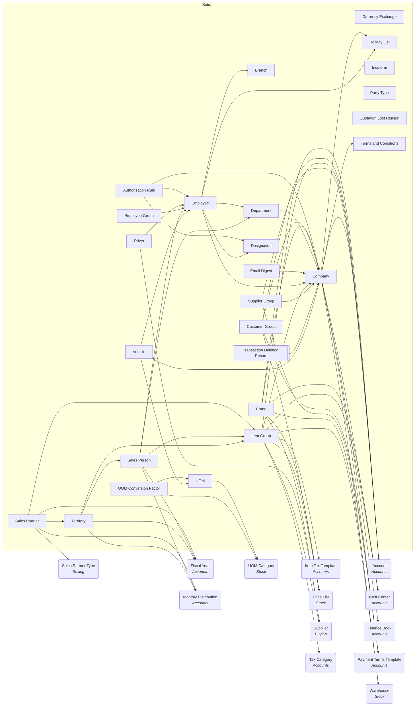

# Setup: relationship diagrams

### Setup: entity dependency graph

Child tables are collapsed into their parent document. Rounded nodes are external
masters owned by other ERPNext modules. `[[ ]]` = submittable transaction. Links to
framework masters (`User`, `File`, `Currency`, `Address`, ...) are omitted here - see
the module reference for the full column list.

