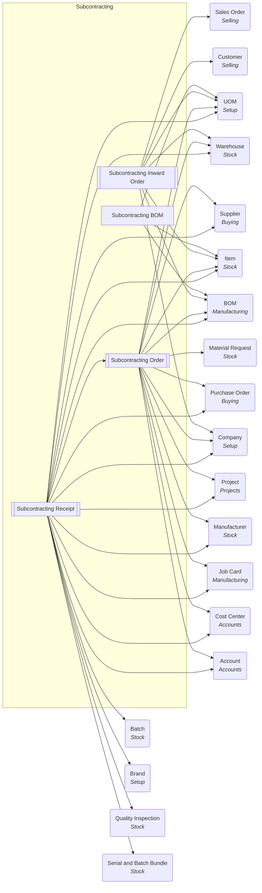

# Subcontracting: relationship diagrams

### Subcontracting: entity dependency graph

Child tables are collapsed into their parent document. Rounded nodes are external
masters owned by other modules. `[[ ]]` = submittable transaction.

